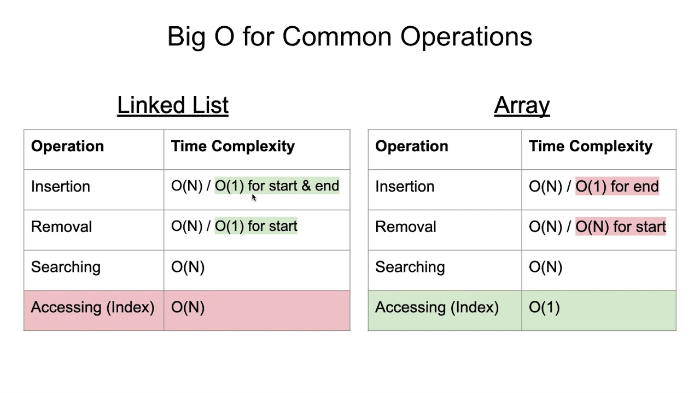

# DataStructure
* Array
* LinkedList
* 

## Array
논리적 저장 순서와 물리적 저장 순서가 일치합니다.    
인덱스를 사용하여 내부 요소를 관리합니다. (인덱스만 알고 있다면 시간 복잡도 O(1)만에 해당 원소로 접근이 가능합니다.)
삽입 또한 마찬가지 입니다. 중간 삽입을 한다면 해당 인덱스보다 큰 인덱스에 위치한 요소들을 한칸씩 뒤로 이동시켜야합니다.
저장 순서가 정해져있기 때문에 배열의 요소를 삭제할 시 삭제한 요소보다 큰 인덱스를 가진 요소들을 한칸씩 앞으로 옮겨줘야 합니다.(시간 복잡도 O(n))       
배열의 크기를 제한적으로 가집니다.   
만약 배열이 가득 차면 추가적으로 원소를 넣기 위해서는 크기를 늘려주는 작업을 해야하는데 이것은 많은 리소스를 소모합니다.   

## LinkedList
요소의 주소값으로 노드를 이용해 서로 연결되어 있는 구조입니다.
원하는 값을 탐색하기 위해서는 리스트를 한번 순회해야 하므로 O(n)의 시간복잡도를 가집니다.   
삽입과 삭제후 Array처럼 추가적인 정렬과정이 없어 빠릅니다. 하지만 삽입/삭제하기 위한 요소의 위치를 찾기위해 리스트를 순회하므로 O(n) 시간복잡도가 발생합니다.   
트리의 근간이 되는 자료구조입니다.   
만약 맨 앞 또는 맨 뒤에서 삽입/삭제가 일어나면 시간 복잡도는 O(1)을 가집니다.

## Array VS LinkedList
### 데이터에 접근(탐색)
Array는 인덱스를 알고있다면 O(1) 인덱스를 모른다면 전체 요소를 탐색하므로 O(n) 시간복잡도를 가집니다.
   
LinkedList는 순차적으로 다음 노드를 따라가면서 탐색하므로 O(n) 시간복잡도를 가집니다.

### 데이터 삽입
Array 맨 끝에 삽입시 O(1)의 시간 복잡도를 가집니다. 중간 삽입시 데이터를 한 칸씩 미뤄야하므로 추가 정렬 시간이 소요됩니다. 또한 배열의 크기가 가득 찼다면 늘려줘야하므로 크기를 늘리는 비용이 추가적으로 발생합니다.

LinkedList 삽입해야하는 위치를 노드 순회를 통해 찾아야 하므로 어느곳에 삽입해도 O(n)의 시간복잡도를 가집니다.

### 데이터 삭제 
Array 삭제 또한 삽입과 마찬가지로 데이터 삭제 시 데이터의 위치를 한 칸씩 이동시켜야합니다.

LinkedList 삽입과 마찬가지로 노드 순회를 통해 삭제할 요소를 찾아야하므로 O(n)의 시간복잡도를 가집니다.

### 메모리 할당
Array는 선언되자 마자 Complie time에 생성됩니다. 이것을 정적 메모리 할당이라고 합니다.   
-> Stack 영역에 메모리 할당   

LinkedList는 새로운 노드가 추가될 때 마다 Runtime에 할당됩니다. 이것을 동적 메모리 할당이라고 합니다.   
-> Heap 영역에 메모리 할당    