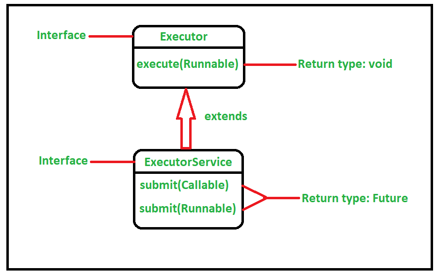

# File, IOStream, Thread (Feat. Http 서버 구현하기)
* [시작](#시작)
* [File](#File)
* [IOStream](#IOStream)
* [Thread](#Thread)
  * [execute()](#execute)
  * [submit()](#submit)

# 시작
우테코 레벨4에서 Http 서버 구현하기를 진행하면서 학습한 Java의 File, IOStream, Thread에 대한 내용입니다.

# File
웹 서버에서 요청이 들어오면 html 파일을 제공해야합니다. 따라서 File을 읽어서 데이터를 응답해줘야 합니다.  
이 때 사용할 수 있는 것이 File 클래스 입니다.
자바는 File 클래스로 폴더(경로)나 파일을 다룰 수 있도록 하고 있습니다. 즉, File 인스턴스는 파일일 수도 폴더일 폴더(경로) 일수도 있습니다.  

웹 요청에 html 파일을 제공하기 위해서 우선 File 객체를 만들어야 합니다.  
리소스 이름만으로 File 객체를 만들려면 다음과 같이 할 수 있습니다. 
```java
File file = new File(getClass().getClassLoader().getResource("리소스 이름").getPath());
```
* getClass() : 현재 객체의 Class타입 객체를 가져옵니다.
* getClassLoader() : 이 클래스를 로드한 클래스 로더를 가져옵니다.
* getResource("리소스 이름") : 주어진 이름을 가진 리소스를 찾습니다. 
> 파일의 이름만 가져오려면 아래와 같이 할 수 있습니다.  
> URI resource = getClass().getClassLoader().getResource("리소스 이름");  
> String fileName = resource.getFile();

이렇게 가져온 파일의 내용을 읽기 위해서 다음과 같이 할 수 있습니다.

```java
File file = new File(getClass().getClassLoader().getResource("리소스 이름").getPath());
Path path = file.toPath();
List<String> fileContents = Files.readAllLines(path);
```

여기서 사용한 Files 클래스를 java.nio 패키지의 클래스입니다.

# IOStream
I/O(입출력)은 하나의 시스템에서 다른 시스템으로 데이터를 이동 시킬 때 사용합니다.  
자바는 스트림(Stream)으로부터 I/O를 사용합니다.  
InputStream은 데이터를 읽고, OutputStream은 데이터를 씁니다.   
FilterStream은 InputStream이나 OutputStream에 연결될 수 있습니다.  
FilterStream은 읽거나 쓰는 데이터를 수정할 때 사용합니다.    

바이트가 아닌 텍스트(문자)를 읽고 쓰려면 문자 데이터를 다루는 스트림인 Reader와 Writer 클래스를 연결합니다.  
Reader, Writer는 다양한 문자 인코딩(e.g. UTF-8)을 처리할 수 있습니다.


자바의 java.io 패키지에 있는 I/O 기능은 Stream을 사용해서 단방향 통신만 가능합니다. 즉, 하나의 Stream으로 입력과 출력을 동시에 할 수 없다는 의미입니다.

> java.nio는 채널을 사용해서 양방향 통신이 가능합니다.

OutputStream은 데이터를 바이트로 처리합니다.  
```java
@Test
void OutputStream은_데이터를_바이트로_처리한다() throws IOException {
    byte[] bytes = {110, 101, 120, 116, 115, 116, 101, 112};
    final OutputStream outputStream = new ByteArrayOutputStream(bytes.length);
    
    outputStream.write(bytes);

    final String actual = outputStream.toString();

    assertThat(actual).isEqualTo("nextstep");
    outputStream.close();
}
```
OutputStream의 서브 클래스는 특정 매체에 데이터를 쓰기 위해 write(int b) 메서드를 사용합니다.
write() 메서드는 데이터를 바이트로 출력하는데 write(int b) 메서드는 1바이트씩 읽어와서 비효율적입니다.
write(byte[] data)와 write(byte b[], int off, int len) 메서드는 한번에 1바이트 이상 읽어올 수 있어서 write(int b)보다 훨씬 효율적입니다.  

자바의 java.io 패키지에서 기본 스트림은 비효율적이기 때문에 보조 스트림을 사용합니다.
대표적으로 버퍼 스트림이 있습니다. 기본 스트림에 BufferedOutputStream을 연결하면 버퍼링이 가능해집니다.

> 버퍼(Buffer)란?
> 기존 자바의 I/O는 1바이트를 쓰면 1바이트를 읽는 구조이기 때문에 느립니다.
> 따라서 버퍼를 사용해 여러개의 바이트를 저장했다가 한번에 출력하는 형태로 사용합니다.

버퍼링을 사용하면 OutputStream을 사용할 때 flush() 메서드는 버퍼가 아직 가득 차지 않은 상황에서 강제로 버퍼의 내용을 전송합니다.   
Stream은 동기(synchronous)로 동작하기 때문에 버퍼가 찰 때까지 기다리면 데드락(deadlock) 상태가 되기 때문에 flush로 해제합니다.  
```java
@Test
void BufferedOutputStream을_사용하면_버퍼링이_가능하다() throws IOException {
    final OutputStream outputStream = mock(BufferedOutputStream.class);
    
    outputStream.flush();
    
    verify(outputStream, atLeastOnce()).flush();
    outputStream.close();
}
```

> 스트림 사용이 끝나면 항상 close() 시켜서 메모리 누수(Memory Leak)을 방지해야합니다.  
> 이때 try-with-resource 문이 유용하게 사용됩니다.  
> try (OutputStream outputStream = new ByteArrayOutputStream(bytes.length);) {  
>   ...  
> }


java.io 패키지에서 InputStream을 사용해서 다른 매체로부터 바이트를 데이터로 읽을 수 있습니다.
바이트를 데이터로 읽기 위해 read() 메서드를 사용합니다.
스트림을 모두 읽고 끝에 도달하면 -1을 반환합니다.
```java
@Test
void InputStream은_데이터를_바이트로_읽는다() throws IOException {
    byte[] bytes = {-16, -97, -92, -87};
    final InputStream inputStream = new ByteArrayInputStream(bytes);
            
    final String actual = new String(inputStream.readAllBytes(), StandardCharsets.UTF_8);
     
    assertThat(actual).isEqualTo("🤩");
    assertThat(inputStream.read()).isEqualTo(-1);
    inputStream.close();
}
```

> InputStream 또한 사용이 끝나면 항상 close() 시켜서 메모리 누수(Memory Leak)을 방지해야합니다.    
> 역시나 try-with-resource 문이 유용하게 사용됩니다.

필터는 필터 스트림, reader, writer로 나뉩니다.     
필터는 바이트를 다른 데이터 형식으로 변환 할 때 사용합니다.   
reader, writer는 UTF-8, ISO 8859-1 같은 형식으로 인코딩된 텍스트를 처리하는 데 사용됩니다.  

BufferedInputStream은 데이터 처리 속도를 높이기 위해 데이터를 버퍼에 저장합니다.  
InputStream 객체를 생성하고 필터 생성자에 전달하면 필터에 연결됩니다.  
버퍼 크기를 지정하지 않으면 버퍼의 기본 사이즈는 8192입니다.  

자바의 기본 문자열은 UTF-16 유니코드 인코딩을 사용합니다.  
바이트를 문자(char)로 처리하려면 인코딩을 신경 써야 합니다.  
InputStreamReader를 사용하면 지정된 인코딩에 따라 유니코드 문자로 변환할 수 있습니다.  
reader, writer를 사용하면 입출력 스트림을 바이트가 아닌 문자 단위로 데이터를 처리하게 됩니다.  

```java
@Test
void BufferedReader를_사용하여_문자열을_읽어온다() throws IOException {
    final String emoji = String.join("\r\n",
        "😀😃😄😁😆😅😂🤣🥲☺️😊",
        "😇🙂🙃😉😌😍🥰😘😗😙😚",
        "😋😛😝😜🤪🤨🧐🤓😎🥸🤩",
        "");
    final InputStream inputStream = new ByteArrayInputStream(emoji.getBytes());
    final BufferedReader bufferedReader = new BufferedReader(new InputStreamReader(inputStream, StandardCharsets.UTF_8));
    final StringBuilder actual = new StringBuilder();
    bufferedReader.lines()
        .map(String::valueOf)
        .forEach(line -> actual.append(line).append("\r\n"));
     
    assertThat(actual).hasToString(emoji);
    final InputStream inputStream2 = new ByteArrayInputStream(emoji.getBytes());
    final BufferedReader bufferedReader2 = new BufferedReader(new InputStreamReader(inputStream2, StandardCharsets.UTF_8));

    final StringBuilder actual2 = new StringBuilder();

    while (bufferedReader2.ready()) {
        actual2.append(bufferedReader2.readLine()).append("\r\n");
    }
    assertThat(actual2).hasToString(emoji);
}
```

# Thread

ExecutorService 인터페이스는 Executor를 상속합니다.   
* 스레드의 실행을 관리하고 제어하는 데 도움이 되는 메서드를 추가했습니다.   
* java.util.concurrent 패키지에 정의되어 있습니다. 
* 결과를 반환하는 스레드, 스레드 집합을 실행하고 종료 상태를 결정하는 메서드를 정의합니다. 
* 이 글에서는 execute()와 submit()라는 두 가지 방법의 차이를 살펴보겠습니다.



## execute
* execute() 메서드는 Runnable 인터페이스만 인자로 받을 수 있습니다.
* execute() 메서드는 반환타입이 void입니다. 즉, 반환 값이 없습니다.
* execute() 메서드는결과에 대해 신경 쓰지 않고 스레드 풀의 작업자 스레드(Worker Thread)에 의해 코드가 병렬로 실행되기를 원할 때 사용됩니다.

## submit
* submit() 메서드는 Runnable 인터페이스와 Callable 인터페이스 모두 인자로 받을 수 있습니다.
* submit() 메서드는 작업의 결과에 대해 관심이 있을 때 사용할 수 있습니다.
* submit() 메서드는 Future 객체를 반환합니다.
  * Future 객체는 비동기 연산의 결과를 의미합니다.
  * 따라서 실행결과가 필요할 때 submit() 메서드를 사용할 수 있습니다.
  * Future 객체의 get() 메서드를 호출해서 결과를 받아볼 수 있습니다.
  * 만약 쓰레드 실행 중 예외가 발생했다면 Future 객체의 get() 메서드를 호출했을 때 해당 예외가 발생합니다.

> Future 객체의 get() 메서드는 blocking call 이므로 주의해야합니다! 