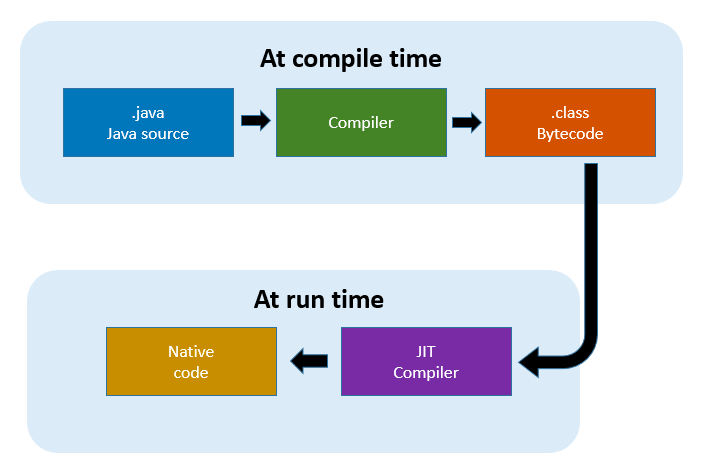

# JVM (Java Virtual Machine)

`자바 가상 머신` 이라는 의미로 바이트 코드(.class)를 OS에 특화된 코드로 변환(인터프리터, JIT 컴파일러) 하여 실행하는 것에 대한 표준.

```
// 바이트 코드 예시

// class version 55.0 (55)
// access flags 0x21
public class Hello {

  // compiled from: Hello.java

  // access flags 0x1
  public <init>()V
   L0
    LINENUMBER 1 L0
    ALOAD 0
    INVOKESPECIAL java/lang/Object.<init> ()V
    RETURN
   L1
    LOCALVARIABLE this LHello; L0 L1 0
    MAXSTACK = 1
    MAXLOCALS = 1

  // access flags 0x9
  public static main([Ljava/lang/String;)V
    // parameter  args
   L0
    LINENUMBER 4 L0
    GETSTATIC java/lang/System.out : Ljava/io/PrintStream;
    LDC "Hello"
    INVOKEVIRTUAL java/io/PrintStream.println (Ljava/lang/String;)V
   L1
    LINENUMBER 5 L1
    RETURN
   L2
    LOCALVARIABLE args [Ljava/lang/String; L0 L2 0
    MAXSTACK = 2
    MAXLOCALS = 1
}
```

JVM 특징
- JVM 자체는 바이트 코드를 실행하는 표준 (바이트 코드를 어떻게 실행할 지에 대한 스펙)
- 구현체가 존재하는데 이는 특정 밴더가 구현한 JVM 이다.
  - 오라클, 아마존 Corretto, Azul, ...
- 특정 플랫폼에 종속적 (OS 에 맞춰서 바이트 코드를 변환하기 때문. Mac 이면 Mac에서 실행하기 위해 특화된 코드로 변환함)

---

# JRE (Java Runtime Environment)

- 자바 애플리케이션을 실행할 수 있도록 구성된 배포판
- JVM과 핵심 라이브러리 및 자바 런타임 환경에서 사용하는 프로퍼티 세팅이나 리소스 파일을 가지고 있음 (JVM + 라이브러리)
- 개발에 필요한 툴 포함 X (개발에 필요한 툴은 JDK에서 제공 / ex. javac 같은 경우 JDK 에 포함됨)

---

# JDK (Java Development Kit)

- JRE + 개발 툴(appletviewer, apt, extcheck, javadoc, jar...등등)
- 소스 코드를 작성할 때 사용하는 자바 언어는 플랫폼에 독립적
- 오라클은 자바 11부터 JDK 만 제공. JRE는 따로 제공하지 않음 (JRE 만 사용하는 경우는 드물다.)

---

# Java (자바)

- 프로그래밍 언어를 의미한다. 
- JDK 에 들어있는 자바 컴파일러(javac)를 사용하여 바이트코드(.class 파일)로 컴파일 할 수 있다.
- JDK와 자바는 다른 것임을 인지해야 한다.
- 자바 라는것은 순수 언어. JDK를 자바라는 언어로 작성된 코드를 실행할 수 있게해주는 키트
  - 자바가 유료화? `오라클이 만든` + `Oracle JDK 11 버전부터` + `상용으로 사용할 때` = 유료.
  - 위의 3가지 조건 중 하나라도 일치하지 않으면 유료가 아니다~
  - 즉, Oracle 이 만든 JDK가 상용으로 사용될 때 유료라는 것이지 자바라는 언어가 유료가 된 것이 아니다.

---

# JVM 언어

- JVM 기반으로 동작하는 프로그래밍 언어 (Groovy, Kotlin 등등..)

---

# JIT 컴파일러(Just-In-Compiler)

- 런타임에 Java 애플리케이션의 성능을 향상시키는 JRE 의 구성 요소이다.
- JVM 에서 컴파일러보다 성능에 더 영향을 미치는 것은 없다.

```
JVM이 느리다?
하드웨어가 뛰어난 지금은 크게 의미 없는 말인듯 하다.
예전에는 JVM의 특징인 인터프리터를 하는 과정과 인터프리터 과정 전에 컴파일 과정을 한번 더 거쳐서 느리다는 단점이 있었다.
JVM은 바이트 코드로 한 번 컴파일 하는 과정과 바이트코드를 인터프리터 하는 방식 2가지를 진행한다.
인터프리터 방식은 소스코드를 런타임에 한줄 한줄 읽어들이는 방식이기 때문에 컴파일 방식보다 느린건 당연하다.

- 컴파일 방식 : 소스 코드를 한꺼번에 모두 읽어서 컴퓨터가 읽을 수 있는 기계어로 변환
- 인터프리터 방식 : 소스 코드를 빌드시에 가만히 있다가, 런타임시 한 줄 한 줄 읽어가며 기계어로 변환 
```

### JIT 컴파일러 개요

- JIT 컴파일러는 런타임 시 바이트 코드를 기계어로 컴파일하여 Java 애플리케이션의 성능을 향상시키는 런타임 환경의 컴포넌트이다.
- JVM은 컴파일과 인터프리터 방식을 모두 사용한다.



1. 컴파일 타임에 컴파일러가 Java 언어로 작성된 코드를 바이트코드(.java 파일)로 변환한다.
2. 런 타임에 인터프리터가 바이트 코드를 읽어서 기계어로 번역한다.
   - 이때 JIT 컴파일러로 최적화를 한다.
   - JIT 컴파일러는 자주 실행되는 바이트 코드가 있다면 이를 미리 기계어로 변환하여 저장해둔다(캐싱).
   - 이후 인터프리터 방식으로 번역하다 JIT 컴파일러에 의해 저장된 부분을 만나면 이미 변환된 기계어 코드를 재사용 한다.
   - 이를 통해 시간 속도 측면에서 개선된 모습을 보여준다. 
   - 하지만 JIT 컴파일러에 의해 초반에 메모리를 선점하고 선행 작업들을 수행하기에 실행 속도는 다소 느릴 수 있다.
   - 실행 속도는 느리지만 기계어 변환 작업에서 속도가 개선됐기에 실행 중 속도는 개선될 수 있는 것이다.
