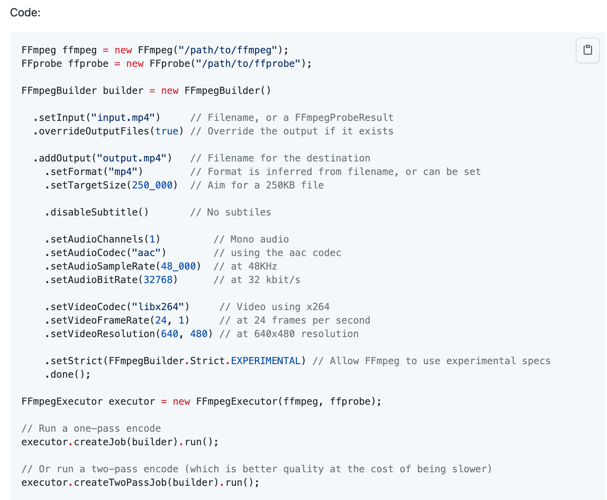

놀토 서비스를 만들면서 프론트엔드 크루가 이미지 저장시 gif 파일 형식을 mp4 파일 형식으로 변환해달라는 요청을 했습니다.         
'gif형식이 대중적이지 않은가?' 라고 생각했는데 gif 파일을 mp4 파일 형식으로 변경했을때 용량의 차이가 어마어마했습니다.   

이름은 다르지만 mp4로 변환한 것이 resize2.mp4 파일입니다. 대략 50배의 용량 차이가 났습니다.   

그래서 당장 'gif파일을 mp4로 어떻게 서버에서 변경해줄 수 있을까?' 고민했습니다.   
놀토에서 이미지는 AWS S3 버킷에 저장하고 있었습니다. 그렇다면 S3에 저장하기 전에 gif를 mp4로 변환해야합니다.      


Java에서 기본적으로 제공해주는 ImageIO는 JPEG, PNG, GIF, BMP 및 WBMP 형식을 기본적으로 제공합니다. 따라서 ImageIO로는 당장 하기에 한계가 있습니다.      

대안으로 [FFmpeg](https://www.ffmpeg.org/about.html) 프로그램이 있습니다. FFmpeg를 사용하면 비디오, 오디오, 이미지를 쉽게 Encoding, Decoding, Muxing,  Demuxing 할 수 있도록 도움을 주는 멀티미디어 프레임워크입니다.      
FFmpeg 프로그램을 사용하면 gif 파일을 mp4로 변환할 수 있습니다. 하지만 FFmpeg는 기본적으로 Command Line 에서 명령을 사용해서 사용할 수 있습니다.   

하지만 우리는 Java에서 이 프로그램의 명령을 실행시켜야합니다. 여기서 사용할 수 있는 [ffmpeg-cli-warpper](https://github.com/bramp/ffmpeg-cli-wrapper) 라는 라이브러리가 있었습니다. 아래와 같이 친숙한 코드로 명령을 내릴 수 있습니다. 게다가 method chaining 을 사용해서 코드를 이해하는데도 어렵지 않습니다.   




단 사용하기 위해 조금 까다로운것이 있습니다.

FFmpeg가 서버내에 설치돼있어야 합니다.   
ffmpeg-cli-warpper 라이브러리는 자바코드로 FFmpeg의 Command Line 명령어를 실행하는것일 뿐 FFmpeg프로그램을 대신할 수는 없습니다.   

앞으로 ffmpeg 적용 과정은 Mac을 기준으로 설명하겠습니다.

먼저 FFmpeg를 설치합니다.

> Ubuntu 설치 시 : apt-get install ffmpeg   
> Mac 설치 시 : brew install ffmpeg   
> 윈도우 설치 시 : 홈페이지에서 다운로드 받으실 수 있습니다 :)

프로젝트에 ffmpeg-cli-warpper 라이브러리 의존성을 추가합니다.   
[Maven Repository - ffmpeg-warpper](https://mvnrepository.com/artifact/net.bramp.ffmpeg/ffmpeg) 에서 가져올 수 있습니다!


Gradle에서는 아래와 같이 의존성을 추가하시면 됩니다.   
> implementation 'net.bramp.ffmpeg:ffmpeg:0.6.2'   

이제 라이브러리의 FFmpeg 와 FFprobe 객체를 생성해야하는데 ffmpeg 와 ffprobe의 경로가 필요합니다.

제가 Mac에 설치했을때 경로는 아래와 같았습니다.

> ffmpeg path => /usr/local/bin/ffmpeg   
> ffprobe path => /usr/local/bin/ffprobe   
>     
> 추가로 ubuntu에 설치하면 아래와 같습니다.   
> ffmpeg path => /usr/bin/ffmpeg   
> ffprobe path => /usr/bin/ffprobe   

경로를 가지고 아래와 같이 객체를 생성할 수 있습니다.

> final FFmpeg fFmpeg = new FFmpeg(ffmpegPath);   
> final FFprobe fFprobe = new FFprobe(ffprovePath);   

[FFmpeg](https://www.ffmpeg.org/ffmpeg.html) : 멀티미디어 간에 파일을 변환하는데 사용하는 Command Line 도구입니다.
[FFprobe](https://www.ffmpeg.org/ffprobe.html) : 간단한 멀티미디어 스트림 분석기 입니다.


이제 FFmpeg 와 FFprobe 객체를 생성했습니다.

명령어를 사용하기 위해서 FFmpegBuilder를 사용해 생성합니다.

```java
FFmpegBuilder builder = new FFmpegBuilder()
                        .overrideOutputFiles(true)
                        .addExtraArgs("-r", "10")
                        .setInput(gifFile.getPath())
                        .addOutput(mp4File.getPath())
                        .addExtraArgs("-an")
                        .setVideoPixelFormat("yuv420p")
                        .setVideoMovFlags("faststart")
                        .setVideoWidth(240)
                        .setVideoHeight(182)
                        .setVideoFilter("scale=trunc(iw/2)*2:trunc(ih/2)*2")
                        .done();
```
사용한 명령어
* overrideOutputFiles : 변환하려는 파일이 이미 존재하면 덮어쓰기를 할지 여부를 결정
* setInput : 변환의 대상 파일을 지정합니다. 즉, 읽어올 파일입니다.
* addOutput : 변환한 파일을 저장할 파일을 지정합니다. 즉, 쓰기를 실행할 파일입니다.
* setVideoPixelFormat : 비디오 픽셀 포맷을 설정합니다.
* setVideoMovFlags : MP4 파일의 구조를 최적화 하여 브라우저가 가능한 한 빨리 파일을 로드할 수 있도록 합니다.
* setVideoWidth : 변환될 파일의 가로(너비) 사이즈를 정합니다.
* setVideoHeight : 변환될 파일의 세로(높이) 사이즈를 정합니다.
* setVideoFilter : 비디오 필터를 설정합니다. 위 명령어에서는 H.264를 사용하는 MP4 비디오는 2로 나눌 수 있는 크기를 가져야 해서 설정한 조건입니다
* addExtraArgs : 커스텀한 명령어를 설정 할 수 있습니다.

* 위의 설정으로 나타낸 명령어는 아래와 같습니다.
> /usr/local/bin/ffmpeg -y -v error -r 10 -i [input파일경로] -pix_fmt yuv420p -movflags faststart -s 240x181 -an [output파일경로]

이제 생성한 명령어 builder 를 실행합니다.

FFmpegExecutor 객체를 생성해서 실행을 합니다.

```java
FFmpegExecutor executor = new FFmpegExecutor(fFmpeg, fFprobe);
FFmpegJob job = executor.createJob(builder);
job.run();
```

간단하게 구현할 수 있지만 한 가지 문제점이 있습니다.   
이미지 변환도 리소스를 꽤 잡아먹는 작업이기 때문에 애플리케이션과 함께 서버에서 돌려도 괜찮을지 고민해봐야합니다.

전체 코드를 보고싶은 분은 여기서 확인할 수 있습니다. (FFmpegTest.java 를 봐주세요)

참고자료
- https://github.com/bramp/ffmpeg-cli-wrapper
- https://jodu.tistory.com/30
- https://velog.io/@tlatldms/FFmpeg%EA%B3%BC-FFprobe
- https://www.ffmpeg.org/
- https://wikidocs.net/78484
- https://unix.stackexchange.com/questions/40638/how-to-do-i-convert-an-animated-gif-to-an-mp4-or-mv4-on-the-command-line
- https://velog.io/@ace0390/Java-ffmpeg%EC%9D%84-%ED%99%9C%EC%9A%A9%ED%95%9C-%EB%8F%99%EC%98%81%EC%83%81-%EC%B2%98%EB%A6%AC%ED%95%98%EA%B8%B0