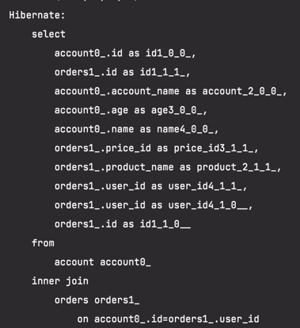
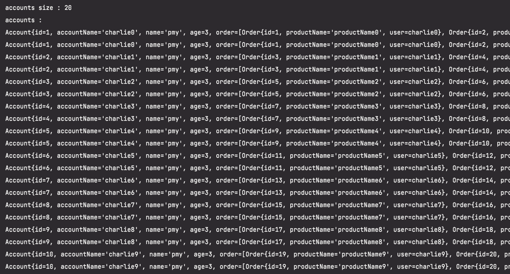

# 카테시안 곱 언제 발생하는가?

Spring Data JPA의 N+1 문제 해결에 대한 글을 살펴보다 카테시안 곱이 무엇인지 궁금해졌습니다.

위키에는 아래와 같이 적혀있습니다.
> 집합론에서 곱집합 또는 데카르트 곱(카테시안 곱)은 각 집합의 원소를 각 성분으로 하는 튜플들의 집합

제가 이해한 바로는 '집합과 집합이 있을때 서로의 원소로 가능한 모든 순서쌍을 의미한다' 입니다.
즉, 집합 A = {a,b,c} , 집합 B = {1,2,3} 일때 아래의 경우가 가능합니다.
* {a, 1}, {a, 2}, {a, 3}
* {b, 1}, {b, 2}, {b, 3}
* {c, 1}, {c, 2}, {c, 3}

Database에서 데이터 조회시 카테시안 곱이 발생할 수 있는 상황은 'join 쿼리 중에 where 절에 기술하는 join조건이 생략됐거나 부적합 할 때' 입니다.

## 애플리케이션 서버에서 카테시안 곱이 발생하면 왜 문제가 될까요?
* 중복된 데이터를 메모리에 올리므로 쓸모없는 메모리 낭비가 생깁니다.

카테시안 곱은 N+1 문제를 해결하기위해 fetch join을 사용하면 발생할 수 있습니다.   
fetch join을 사용하면 inner 조인을 사용하는데 이떄 카테시안 곱이 발생할 수 있습니다.

## 학습 테스트

학습테스트로 진행한 도메인입니다.
* Account
* Orders
```java
@Entity
public class Account {

    @Id @GeneratedValue(strategy = GenerationType.IDENTITY)
    private Long id;

    private String accountName;
    private String name;
    private int age;

    @OneToMany(mappedBy = "user", cascade = CascadeType.ALL)
    private List<Order> order = new ArrayList<>();
```
```java
@Entity
public class Orders {

    @Id @GeneratedValue(strategy = GenerationType.IDENTITY)
    private Long id;

    private String productName;

    @ManyToOne(fetch = FetchType.LAZY)
    @JoinColumn(name = "user_id")
    private Account user;
```

아래는 AccountRepository에서 사용한 JPQL입니다.
```java
public interface AccountRepository extends JpaRepository<Account, Long> {

    @Query("select a from Account a join fetch a.orders")
    List<Account> findAllJoinFetch();
    
    ...
}
```

테스트 코드는 다음과 같습니다.

```java
@DataJpaTest
class CartesianProductTest {

    @Autowired
    private AccountRepository accountRepository;

    @Autowired
    private OrdersRepository ordersRepository;

    @Autowired
    private EntityManager entityManager;

    @BeforeEach
    void setUp() {
        for (int i = 0; i < 10; i++) {
            Account account = new Account("charlie" + i, "pmy", 3);
            account.addOrder(new Orders("productName" + i).setPrice(new Price(1000L)));
            account.addOrder(new Orders("chocolate" + i).setPrice(new Price(2000L)));
            Account savedAccount = accountRepository.save(account);
        }
    }

    @DisplayName("N+1 쿼리문제를 fetch join으로 해결하면 카테시안 곱이 발생할 수 있다. (inner join)")
    @Test
    void fetchJoin() {
        entityManager.flush();
        entityManager.clear();
        List<Account> accounts = accountRepository.findAllJoinFetch();

        assertThat(accounts).hasSize(20);

        System.out.println("accounts size : " + accounts.size());
        System.out.println("accounts : ");
        accounts.forEach(System.out::println);

        List<String> collect = accounts.stream()
                .flatMap(account -> account.getOrder().stream())
                .map(Orders::getProductName)
                .collect(Collectors.toList());

        collect.forEach(System.out::println);
    }
}
```

account 10개와 각각의 account에는 2개의 order를 가지도록 했습니다.

N+1은 해결해서 조회 쿼리 1번으로 전부 조회해옵니다.



하지만 아래와 같이 카테시안 곱이 발생해서 20건의 account를 가져오고 있습니다.
(account가 2개씩 중복된것을 볼 수 있습니다.)



카테시안 곱을 해결하는 방법은 두 가지가 있습니다.
1. 반환 타입으로 Set Collection을 사용
2. 쿼리에 distinct를 추가해서 중복 제거

## 반환 타입으로 Set Collection을 사용
조회 메서드의 반환 타입을 List가 아닌 Set으로 해서 중복을 제거할 수 있습니다.
```java
public interface AccountRepository extends JpaRepository<Account, Long> {
    @Query("select a from Account a join fetch a.orders")
    Set<Account> findAllSetJoinFetch();
```
```java
    @DisplayName("카테시안 곱 문제를 반환 컬렉션 타입을 Set으로 변경해서 해결한다.")
    @Test
    void setCollectionFetchJoin() {
        entityManager.flush();
        entityManager.clear();
        Set<Account> accounts = accountRepository.findAllSetJoinFetch();

        assertThat(accounts).hasSize(10);

        System.out.println("accounts size : " + accounts.size());
        System.out.println("accounts : ");
        accounts.forEach(System.out::println);

        List<String> collect = accounts.stream()
                .flatMap(account -> account.getOrder().stream())
                .map(Orders::getProductName)
                .collect(Collectors.toList());

        collect.forEach(System.out::println);
    }
```
위 테스트는 정상적으로 10개의 account를 가져옵니다.

## 쿼리에 distinct를 추가해서 중복 제거
조회 쿼리에 distinct 키워드를 추가하여 중복을 제거할 수 있습니다.
```java
public interface AccountRepository extends JpaRepository<Account, Long> {
    @Query("select distinct a from Account a join fetch a.orders")
    List<Account> findAllDistinctJoinFetch();
}
```
```java
    @DisplayName("카테시안 곱 문제를 fetch join 쿼리에 distinct를 추가해서 해결한다.")
    @Test
    void distinctFetchJoin() {
            entityManager.flush();
            entityManager.clear();
            List<Account> accounts = accountRepository.findAllDistinctJoinFetch();

        assertThat(accounts).hasSize(10);

        System.out.println("accounts size : " + accounts.size());
        System.out.println("accounts : ");
        accounts.forEach(System.out::println);

        List<String> collect = accounts.stream()
        .flatMap(account -> account.getOrder().stream())
        .map(Orders::getProductName)
        .collect(Collectors.toList());

        collect.forEach(System.out::println);
        }
```

Set은 애플리케이션에서 중복을 처리하는 것이고 distinct는 DB에서 중복을 처리합니다.   
distinct로 했을때는 반환타입을 List로 지정할 수 있습니다.   
Set과 distinct 중 상황에 맞게 설정하시면 됩니다!   

학습테스트는 [이 곳](https://github.com/Gomding/spring-data-jpa-test)에서 볼 수 있습니다.