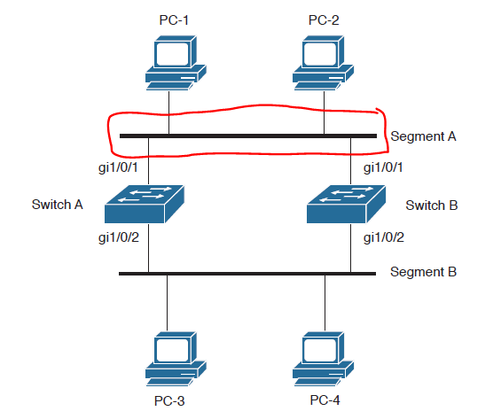

# DataStructure
* [Array](#Array)
* [LinkedList](#LinkedList)
* [HashTable](#HashTable)
* [Hash 충돌](#Hash충돌)

## Array
논리적 저장 순서와 물리적 저장 순서가 일치합니다.    
인덱스를 사용하여 내부 요소를 관리합니다. (인덱스만 알고 있다면 시간 복잡도 O(1)만에 해당 원소로 접근이 가능합니다.)
삽입 또한 마찬가지 입니다. 중간 삽입을 한다면 해당 인덱스보다 큰 인덱스에 위치한 요소들을 한칸씩 뒤로 이동시켜야합니다.
저장 순서가 정해져있기 때문에 배열의 요소를 삭제할 시 삭제한 요소보다 큰 인덱스를 가진 요소들을 한칸씩 앞으로 옮겨줘야 합니다.(시간 복잡도 O(n))       
배열의 크기를 제한적으로 가집니다.   
만약 배열이 가득 차면 추가적으로 원소를 넣기 위해서는 크기를 늘려주는 작업을 해야하는데 이것은 많은 리소스를 소모합니다.   

## LinkedList
요소의 주소값으로 노드를 이용해 서로 연결되어 있는 구조입니다.
원하는 값을 탐색하기 위해서는 리스트를 한번 순회해야 하므로 O(n)의 시간복잡도를 가집니다.   
삽입과 삭제후 Array처럼 추가적인 정렬과정이 없어 빠릅니다. 하지만 삽입/삭제하기 위한 요소의 위치를 찾기위해 리스트를 순회하므로 O(n) 시간복잡도가 발생합니다.   
트리의 근간이 되는 자료구조입니다.   
만약 맨 앞 또는 맨 뒤에서 삽입/삭제가 일어나면 시간 복잡도는 O(1)을 가집니다.

## Array VS LinkedList
### 데이터에 접근(탐색)
Array는 인덱스를 알고있다면 O(1) 인덱스를 모른다면 전체 요소를 탐색하므로 O(n) 시간복잡도를 가집니다.
   
LinkedList는 순차적으로 다음 노드를 따라가면서 탐색하므로 O(n) 시간복잡도를 가집니다.

### 데이터 삽입
Array 맨 끝에 삽입시 O(1)의 시간 복잡도를 가집니다. 중간 삽입시 데이터를 한 칸씩 미뤄야하므로 추가 정렬 시간이 소요됩니다. 또한 배열의 크기가 가득 찼다면 늘려줘야하므로 크기를 늘리는 비용이 추가적으로 발생합니다.

LinkedList 삽입해야하는 위치를 노드 순회를 통해 찾아야 하므로 어느곳에 삽입해도 O(n)의 시간복잡도를 가집니다.

### 데이터 삭제 
Array 삭제 또한 삽입과 마찬가지로 데이터 삭제 시 데이터의 위치를 한 칸씩 이동시켜야합니다.

LinkedList 삽입과 마찬가지로 노드 순회를 통해 삭제할 요소를 찾아야하므로 O(n)의 시간복잡도를 가집니다.

### 메모리 할당
Array는 선언되자 마자 Complie time에 생성됩니다. 이것을 정적 메모리 할당이라고 합니다.   
-> Stack 영역에 메모리 할당   

LinkedList는 새로운 노드가 추가될 때 마다 Runtime에 할당됩니다. 이것을 동적 메모리 할당이라고 합니다.   
-> Heap 영역에 메모리 할당    

--- 

## HashTable
### 개념   
Key : Value 1:1로 연관지어 저장하는 자료구조
Key를 이용해서 Value를 가져옵니다.

> Hash 함수의 조건   
> ① 압축: x 길이 평문을 고정된 길이의 출력값으로 변환   
> ② 일방향 (One Way Function, 선이미지 회피성): 역방향 계산 불가능 -> 즉 A라는 값의 Hash값은 항상 같은 값이 나오지만 Hash로 A라는 값을 다시 가져올 수 없음   
> ③ 효율성: 해시값 계산에 시간이 많이 소요되지 않아야 함   
 
### 기능
Key, Value가 주어졌을 때, 두 값을 저장합니다.   
Key로 Key에 연관된 Value를 조회할 수 있다.   
기존 Key에 새로운 Value가 주어지면, 기존 Value를 새로운 Value로 덮어쓴다.
Key가 주어졌을때 해당 Key에 관련된 Value 삭제

### HashTable 구조
**Key, Hash Function, Hash, Value, 저장소(Bucket, Slot)구성**
* Key
  - HashTable에서 고유한 값
  - 저장 공간의 효율성을 위해 Hash Function에 입력하여 Hash로 변경 후 저장
  - Key으 길이가 다양하기 때문에 그대로 저장하면 다양한 길이 만큼의 저장소가 필요합니다.
* Hash Function
  - Key를 Hash 로 변경하는 역할
  - Hash 충돌이 발생할 확률을 최대한 줄이는 함수를 만드는 것이 중요
> Hash 충돌 : 서로 다른 Key가 같은 Hash가 된 경우

> 좋은 Hash Function 이란?    
> 현실에서 키는 랜덤하지 않습니다.   
> 만약 키들의 통계적 분포를 알고있다면 이를 이용해서 Hash Fcuntion을 만드는것이 가능하겠지만 현실적으로 어렵습니다.   
> 키들이 어떤 패턴을 가지더라도 Hash Function값은 불규칙적으로 만들어지는게 바람직합니다.   
> Hash 값이 Key의 특정 부분에 의해서 만들어지면 안됩니다.   

* Hash
  - Key에 Hash Function을 사용한 결과   
  - 저장소에 Value(값)과 매칭해서 저장
* Value
  - 저장소에서 최종적으로 저장되는 값
  - 키와 매칭해서 저장, 삭제, 접근이 가능

### HashTable 동작 과정
1. Key -> HashFunction -> Hash
2. Hash를 배열의 index로 사용
3. 해당 index에 value 저장
> HashTable의 크기가 10이라면 A라는 Key의 Value를 찾을 때 hashFunction("A") & 10 연산을 통해서 인덱스 값을 계산하여 Value를 조회합니다.

### HashTable 장점
* 적은 리소스로 많은 데이터를 효율적으로 관리 가능
* 배열의 인덱스를 사용하기 때문에 빠른 검색, 삽입, 삭제 O(1)
  - HashTable의 경우 인덱스는 데이터의 고유 위치이기 때문에 삽입, 삭제시에 재정렬할 필요가 없음
* Hash와 Key 사이에 연관성이 없어서 보안에 유리합니다.
* 데이터 캐싱에 많이 사용
  - get, put 기능에 캐시 로직 추가시 자주 hit하는 데이터 바로 검색 가능
* 중복 제거에 유용

### HashTable 단점
* 충돌 발생 가능성이 존재
* 공간 복잡도 증가
* 순서가 없음
* 해시 함수에 의존적

> HashTable VS HashMap     
> Key-Value를 관리하는것은 동일  
> HashTable -> 동기, Key-Value 값으로 null을 허용하지 않음   
> HashMap -> 비동기, Key-Value 값으로 null을 혀용

---

## Hash충돌
* Separating Chaining
* Open Addressing
* 
### Hash 충돌
* 서로 다른 Key가 Hash Function에서 중복 Hash로 나온 경우
* 충돌이 많을수록 O(1)에서 최대 O(N)까지 증가

### Hash 충돌 해결방법

### Separating Chaining
* JDK 내부에서 사용하는 충돌 처리 방식
* 충돌 Hash 값을 첫 부분(헤드)으로 하는 링크드 리스트로 해결
* 충돌난 Hash 값을 헤드로 하는 링크드 리스트에 노드를 추가하여 Value 삽입
* LinkedList 구조를 사용하기 때문에 데이터 수 제약이 적은편 
* Java 8부터는 더 향상된 방법을 사용하여 충돌을 피함 (HashMap에 적용)
  - 하나의 버킷에 충돌이 집중되는 현상을 막기위한 방법
  - 충돌된 Key-Value 쌍의 데이터가 8개 모이면 링크드 리스트를 트리로 변경(Red Black Tree)
  - 트리로 변경된 상태에서 충돌된 Key-Value 쌍의 데이터가 6개로 줄어들면 다시 LinkedList를 사용함
  - 8 -> 7 이 아니라 8 -> 6 이 기준인 이유는 트리에서 LinkedList로 잦은 변경을 방지하기 위해서(성능 저하를 막기위함)

### Open Addressing
* 추가 메모리 공간을 사용하지 않고, HashTable 배열의 빈 공간을 사용하는 방법
* Separating Chaining 방식에 비해 적은 메모리를 사용
* HashTable내의 빈 공간을 찾는 방법은 선형 탐색, 제곱 탐사, 이중 해싱
  - 선형 탐사(Linear Proving) : 해시 충돌시 빈 공간을 찾기위해 이동하는 폭을 고정시킴(ex. 1칸씩 이동). 가장 간단하지만 메모리가 전부 차있다면 빈 공간을 찾는데 비효율적입니다.
  - 제곱 탐사(Quadratic probing) : 선형 탐사와 같지만 이동하는 폭을 제곱수로 늘려나감.  1의 제곱 -> 또 충돌이라면 2의 제곱 -> 또또 충돌이라면 3의 제곱
  - 이중 해싱(Double Hashing) : Key의 Hash 값과 이동하는 폭의 Hash 값 두개를 만들어서 이동하는 폭의 값에 규칙성을 없애버려서 Clustering을 방지하는 기법입니다.

### Resizing
* 저장 공간이 일정량 이상 채워지면 공간을 확장시킴
* Separating Chaining의 경우 성능 향상을 위해서
* Open Addressing의 경우 배열의 확장을 위해서
* 확장 임계점은 현재 데이터 개수가 Bucket의 75% 이상 일 때

### 참고자료
* [https://ratsgo.github.io/data%20structure&algorithm/2017/10/25/hash/](https://ratsgo.github.io/data%20structure&algorithm/2017/10/25/hash/)
* [https://odol87.tistory.com/4](https://odol87.tistory.com/4)