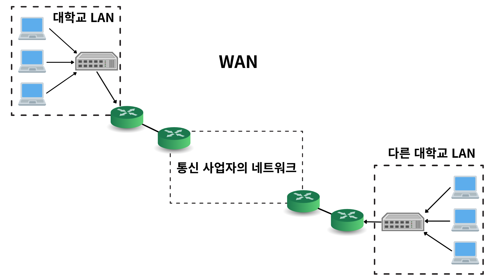
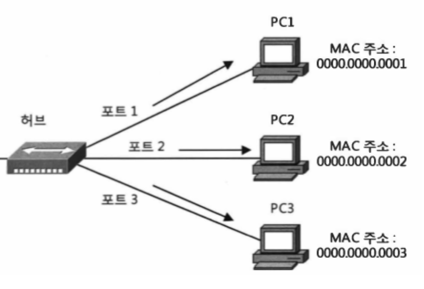
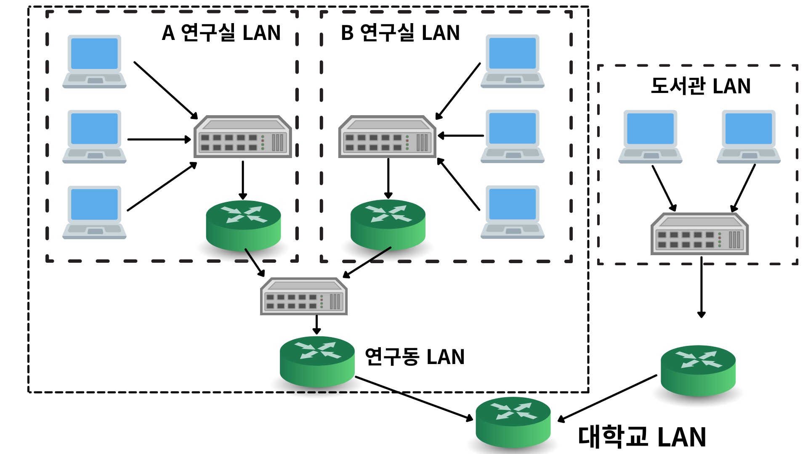

# DataBase
* [Connection](#Connection)
* [Index](#Index)
* [Transaction](#Transaction)

## Connection
애플리케이션에서 데이터베이스에 접근하기위해 필요한 객체

## Connection Pool
Connection Pool은 Connection을 특정 공간(캐시 공간)에 미리 생성 해둔것을 의미합니다.   
클라이언트의 요청에 Thread에서 Connection Pool에 미리 생성해둔 Connection을 꺼내 쓰고 다시 반환하게 합니다.    

> 웹 서버(웹 애플리케이션 서버)에서 데이터베이스에 연결하기 위한 Connection 객체를 생성하는 비용은 작지 않습니다.   
> 클라이언트의 요청에 매번 Connection을 생성하는 것은 많은 비용을 발생시킬 수 있습니다.

## Connection Pool의 설정 값
* maxActive : 동시에 연결될 수 있는 최대 커넥션 개수
* maxIdle : Connection Pool에 반납할 때 최대로 유지할 커넥션 개수
* minIdle : 최소한으로 유지할 커넥션 개수
* initialSize : 최초로 getConnection() Method를 통해 커넥션 풀에 채워넣을 커넥션의 개수

**maxActive >= initialSize**   
동시에 연결될 수 있는 커넥션 개수(maxActive)는 최초로 생성할 커넥션 개수(initialSize)보다 크거나 같아야합니다. maxActive < initialSize도 설정은 가능하지만 논리적인 오류가 있는 설정입니다.   
**maxIdle > minIdle**   
최대로 유지할 커넥션 개수는(maxActive)는 최소로 유지할 커넥션 개수(minIdle)보다 커야합니다. maxIdle < minIdle도 설정은 가능하지만 논리적 오류가 있는 설정입니다.      
**maxActive = maxIdle**   
maxActive와 maxIdle 값은 같은것이 바람직합니다.   
maxActive = 10, maxIdle = 5 설정된 상태라고 가정합니다. 
현재 커넥션을 동시에 5개 사용중인 상황에서 추가로 1개의 커넥션 요청이 오면 maxActive = 10 이므로 커넥션을 추가로 생성하여 데이터베이스에 연결합니다. 
그 후 커넥션을 풀에 반납하면 현재 생성된 커넥션이 6개이므로 maxIdle = 5 설정값에 의해 커넥션이 닫힙니다.    
따라서 maxActive와 maxIdle설정이 같지않다면 매번 커넥션을 생성하고 닫는 비용이 발생할 수 있습니다.   

maxActive 값은 DBMS 설정과 애플리케이션 서버의 개수, Apache, Tomcat에서 동시에 처리할 수 있는 사용자(요청)의 수를 고려해서 설정해야합니다.   
DBMS가 수용할 수 있는 커넥션 개수를 확인하고 애플리케이션 서버 1대가 사용할 수 있는 적절한 커넥션 개수를 확인해서 설정해야합니다.
**사용자가 몰려서 커넥션을 많이 사용한다면 maxActive 값이 충분히 크지않다면 병목지점이 될 수 있습니다**

## maxWait
maxWait 설정값은 커넥션을 얻기 전 대기 시간입니다.
커넥션 풀 안에 커넥션이 없을 때 커넥션 반납을 대기하는 시간이며 기본값을 무한정입니다.   
maxWait 값을 설정하지 않고 기본값으로 무한정 대기하도록 해도 일반적으로는 문제가 안됩니다.   
하지만 사용자가 급증하거나 DBMS에 장애가 발생했다면 장애를 더욱 크게 확산할 수 있습니다.

적절한 maxWait 값을 설정하려면 TPS(transaction per seconds)와 Tomcat에서 처리 가능한 스레드 개수 등을 이해해야 합니다.

## TPS(Transaction per second)
사용자의 요청 하나에 쿼리 10개를 실행한다고 가정하고 각 쿼리는 50밀리초가 걸린다고 하면 10개의 쿼리는 500 밀리초가 걸립니다.   
다른 컴포넌트에 대한 처리시간은 생각하지않고 쿼리 처리시간만 생각했을 때 1요청에 걸리는 시간이 500밀리초라고 할 수 있습니다.   
만약 사용 가능한 커넥션이 5개라면 동시에 5개의 요청을 각각 500밀리초(0.5초)로 처리합니다. 즉, 1초 동안 10개의 요청을 처리할 수 있습니다.   
이때 성능 지수는 10TPS라고 할 수 있습니다.

## TPS와 커넥션 개수와의 관계
위에서 봤듯이 커넥션풀의 커넥션 개수가 5개라면 10TPS 이상의 성능을 낼 수 없습니다.   
커넥션풀에서 운영하는 커넥션이 5개이고 10개의 요청이라면 5개의 요청은 처리되지만 나머지 5개의 요청은 대기(wait)상태가 되어 여분의 커넥션이 생길때까지 maxWait 값만큼 기다립니다.   
여기서 성능을 향상시키는 가장 간단한 방법은 maxActive값을 늘리는것입니다.현재 maxActive = 5 이지만 maxActive = 10으로 늘리면 10TPS에서 20TPS로 늘어납니다.   

하지만 일반적으로 DBMS의 리소스는 다른 서비스와 공유해서 사용하는 경우가 많아서 무조건 커넥션 수를 늘릴 수는 없습니다.      
(DBMS도 수용 가능한 커넥션이 설정값으로 정해져있습니다.)   
따라서 커넥션 풀의 커넥션 수를 무조건 늘리는것보다 예상 접속자수와 실제 부하를 측정해서 최적의 값을 설정하는 것이 중요합니다.      
대기 시간(wait) 값을 잘 조절하는것이 커넥션 개수를 무한히 늘리지않고 최적의 시스템 환경을 구축하는데 중요한 역할을 합니다.    
maxWait 값을 어떻게 설정했는지가 일시적인 과부하 상태에서 드러나는 시스템의 전체적인 견고함을 결정짓습니다.   

## 적절한 maxWait 설정값 찾는 방법?
적당한 설정값을 찾기위해서는 Commons DBCP외에 Tomcat의 동작 방식을 고려해야합니다.   
Tomcat은 스레드 기반으로 동작해서 사용자의 요청을 처리합니다.   
Commons DBCP가 스레드 풀을 가지고 있는것처럼 Tomcat도 내부적으로 스레드 풀(wait set)을 가지고 있습니다.      
위에서 처럼 5개의 커넥션이 사용중이고 6번째 요청이 왔을 때 maxWait만큼 기다리는 주체는 Tomcat의 스레드입니다.   
maxWait = 10000 으로 설정하면 10초를 기다립니다. 즉, 처리량을 넘어서면 스레드가 다음 커넥션을 요청하기까지 10초동안 대기하는 것입니다. 
계속 요청이 들어오면 결국 Tomcat의 스레드 풀에 존재하는 모든 스레드를 사용하게 되고 Tomcat은 스레드가 없음을 알리는 오류를 출력하며 멈춥니다.   
> 심각: All threads (512) are currently busy, waiting. Increase maxThreads (512) or check the servlet status

10초가 지나서 커넥션을 획득하고 작업을 완료하여 성공적으로 응답을 보내도 대부분의 사용자는 이미 떠난 후입니다.(대부분의 사용자는 2~3초내에 응답이 없으면 요청 페이지를 떠납니다.)   
**즉, 사용자가 인내할 수 없는 시간을 넘는 maxWait값은 의미가 없습니다.**

반대로 maxWait값이 너무 작으면 커넥션이 없으면 자주 커넥션을 요청하게 될것이고 사용자는 오류메세지를 자주 보게 될 것입니다.   

그래서 maxWait는 사용자의 대기 가능한 시간, 애플리케이션의 특성과 주변의 다른 설정, 자원의 상황등을 고려해서 값을 정해야합니다.   
만약 사용자가 급증해서 maxWait안에 커넥션을 얻지 못하는 빈도가 증가한다면 maxWait값을 줄여서 시스템에서 사용하는 스레드 개수가 한계에 도달하지 않도록 방어할 수 있습니다.
(maxWait를 줄여서 실패한 스레드는 빠르게 반환하도록 유도하여 스레드 순환이 빠르게 돌도록 함)    
> 위와 같은 상황이 자주 발생한다면 Commons DBCP의 커넥션 풀 maxActive값과 Tomcat의 스레드 풀의 스레드 개수를 증가시키는 것을 고려해야합니다.

시스템 자원이 한도를 넘어섰다면 애플리케이션 서버의 확충(스케일 업 or 스케일 아웃)을 해야합니다.

## DBMS의 커넥션 최대 개수 설정하기
DBMS의 커넥션 최대 개수 설정 보는법
> show variables like '%max_connection%';   

DBMS에서 사용됐던 동시 최대 커넥션 숫자
> show status like '%max_used_connections%';

DBMS에서 수용 가능한 최대 커넥션 수를 설정하는 법 (대부분 default로 151이 설정됨) 
> set global max_connections = 500;

### 참고자료
* [Commons DBCP 이해하기 - NaverD2](https://d2.naver.com/helloworld/5102792)

---

## Index

사전적 의미 : 색인, 어떤것을 뒤져서 찾아냄   
데이터 베이스에서의 인덱스 : 대용량 데이터 조회(READ)시 성능을 향상시켜주는 객체   
R(select)에서 성능향상 반면에 CUD(insert,update,delete)에서 성능 희생

### 인덱스의 저장공간

- 인덱스도 하나의 **객체**로 추가 저장공간이 필요(저장된 데이터의 10% 정도가 필요)
- InnoDB (MySQL)는 디스크에 데이터를 저장하는 가장 기본 단위를 페이지라고 함
- **인덱스 역시 페이지 단위로 관리**
- MySQL 5.5 - 페이지는 16KB 로 크기가 고정
- MySQL 5.6 - 설정 옵션에따라 페이지 크기 제어가능 4KB, 8KB, 16KB (innodb_page_size 설정)
- MYSQL 5.7이후 - 32KB, 64KB크기를 지원(32KB, 64KB는 FOW_FORMAT= COMPRESSED 지원하지않음)

[https://sungwookkang.com/1213](https://sungwookkang.com/1213)

### 인덱스 키

- 인덱스로 지정한 컬럼의 크기(용량) ex. varchar(20)과 varchar(255)는 varchar(255)의 인덱스 키의 크기가 크다 라고 함
- 인덱스 키에는 제한 용량이 있음. 767byte / mariadb 10.5 dump 10.1버전에 복구하니까 인덱스 키 용량때문에 복구가 안된다함
- varchar(255)를 초과하면 위의 용량을 초과할 수 있음
- 페이지가 16KB일 때 인덱스 키가 50byte라면 (인덱스 키 외에 다른 용량도 고려해야하지만 여기선 제외)   
  16*1024 / 50   
  하나의 페이지에 약 327개의 데이터를 저장할 수 있음.   
- 인덱스 키가 100byte라면?
  하나의 페이지에 약 164개의 데이터를 저장할 수 있음.
→ 300개의 데이터 row를 읽을 때 50byte라면 1개의 페이지만 읽어도되지만 100byte면 2개의 페이지를 읽어야함   
→ 인덱스 키도 성능에 영향이 있다.

### Clustered Index

- 테이블당 1개만 존재
- PK제약조건으로 컬럼을 생성하면 자동 생성(PK가 없을 때 Unique 컬럼을 생성하면 Clustered Index 자동 생성)
    - Unique 컬럼을 먼저 생성하고 이후에 PK 컬럼을 새로 생성하면 PK컬럼에 Clustered Index 생성되고 Unique 컬럼은 Non-Clustered Index로 변경됨)
    - 48kb 히든 컬럼 → 별 기능없어서 PK 만들어주는게 좋음
- **인덱스에 데이터 페이지가 함께 존재**
- 리프 페이지 == 데이터 페이지(BTree)
- 데이터가 정렬된 상태여야 한다.
- CUD(추가, 수정,삭제)에서 데이터페이지를 정렬시켜야함 정렬된 상태

### Non-Clustered Index(Secondary Index)

- 다수가 존재 할 수 있음
- Unique 제약조건으로 컬럼을 생성하면 Non-Clustered Index가 자동 생성
- 인덱스에 데이터페이지가 존재하지 않음
    - 최종적으로 데이터페이지의 주소를 가리킴
- CUD(추가, 수정,삭제)에서 데이터페이지를 정렬하지 않아도됨 → 데이터가 정렬되지 않아도 된다.
- 데이터 페이지를 포함하지 않기 때문에 Clustered Index와 비교해서 조회 속도가 조금 떨어짐(Clustered Index와 비교해서 떨어지는것이 느린것이 아님)
- 데이터 페이지 정렬이 필요없으므로 CUD 성능이 Clustered Index와 비교시 부하가 적음

### 카디널리티(Cardinality)

인덱스의 효율성을 판단할 수 있는 수치 중 하나   
사전적 의미: 집합의 크기 또는 농도, 집합의 원소 개수에 대한 척도

[https://ko.wikipedia.org/wiki/집합의_크기](https://ko.wikipedia.org/wiki/%EC%A7%91%ED%95%A9%EC%9D%98_%ED%81%AC%EA%B8%B0)

데이터베이스에서는 해당 컬럼의 중복된 수치를 의미

좀 더 쉽게 이해하려면 카디널리티는 **'컬럼 내부의 유니크한 값의 개수'** 라고 할 수 있다.   
ex. 연필, 연필, 지우개, 볼펜, 형광펜, 형광펜, 형광펜 이렇게 데이터가 있으면 유니크한 값은 [연필, 지우개, 볼펜, 형관펜] 4개다 
- 카디널리티가 높다 == '중복도가 낮다'
    - 주민등록번호, 우편번호, 주소, 전화번호 등등은 중복도가 낮으므로 카디널리티가 높다.
- 카디널리티가 낮다 == '중복도가 높다'
    - 성별, 국가 의 경우 중복도가 높으므로 카디널리티가 낮다.

### 인덱스는 카디널리티가 높은 컬럼에 생성하면 효율이 상승한다.

- 성별의 경우 남,여 만 존재하기때문에 50%의 데이터만 필터링 → 나머지 50%에서 원하는 데이터를 다시 찾아야함
- 주민등록번호의 경우 인덱스를 통해 대부분의 데이터를 필터링 → 빠른 검색 가능

### 인덱스 자료구조

- HashTable
- B-Tree
- B+Tree

HashTable

- 우리가 흔히 아는 HashTable임
- 단일 조회에 특화됨 (where name = xxx) O(1)
- 범위 검색은 문제가 발생 (where age > 10)

B-Tree

- 데이터가 항상 정렬된 상태
- 가장 상단을 '루트 노드'
- 중간 노드를 '브랜치 노드'
- 마지막 노드를 '리프 노드'
- 같은 높이를 유지하기 때문에 어떤 데이터를 조회해도 비슷한 시간이 걸리는게 특징 = 균일성
- 브랜치 노드에서도 '키-값'의 형태로 있어서 데이터를 더 빨리 찾을 수 있다. → 키-값을 가지는 만큼 용량은 더 크므로 데이터의 숫자가 줄어듬 → 트리의 높이는 더 크다



B+Tree

- B-Tree와 구조는 똑같음
- 단 중간 노드(브랜치 노드)에서 '키-값'을 가지는게 아니라 **키만 가지고 있음**
- 중간 노드는 키만을 가지기 때문에 키-값을 가지는것보다 하나의 데이터가 차지하는 용량이 작음 → 더 많은 키를 가짐 → 트리의 높이가 낮아짐
- 리프 노드에서만 키-값을 가짐
- 같은 레벨의 노드끼리는 Doubly-LinkedList로 연결됨
- 자식 노드와는 Singly-LinkedList로 연결됨



[InnoDB](https://blog.jcole.us/innodb/)

---

## Transaction
* 데이터의 정합성을 보장해줍니다. (작업의 완전성을 보장)
* 논리적인 작업셋을 완벽하게 처리 or 하나라도 처리하지 못할 경우 원상태로 복구해서 작업의 일부만 반영되지 않도록 하는 기능
* 잠금(Lock)은 동시성을 제어하기 위한 기능 (동시성을 보장해야하는 경우 Lock을 활용해서 다른 작업을 막음)

### 스토리지 엔진(Strage Engine)
* MyISAM, MEMORY -> 트랜잭션을 지원하지 않음
  * 트랜잭션을 지원하지 않기 때문에 테이블이 부분 업데이트 되는 현상이 발생할 수 있습니다.)
    * ex. 상품 주문 시 상품 주문에 대한 레코드 추가와, 상품 개수 수정이 발생해야하는데 상품 주문 추가는 성공적으로 했지만 삼품 개수 수정에서 예외가 발생하면 상품 주문은 이뤄졌지만 개수가 줄어들지 않았으므로 이런 상황을 부분 업데이트가 일어났다고 합니다.
  * 데이터 정합성을 맞추는게 상당히 어렵습니다.
* InnoDB -> 트랜잭션을 지원
  * 하나의 트랙잭션은 1개 이상의 쿼리든 논리적인 작업셋 하나로 100% 완료 되거나 or 논리적인 작업셋 내부에서 쿼리 하나라도 완료되지 못하면 어떤것도 적용하지 않는것입니다.
    * 100% 완료돼서 작업을 적용시킴 (commit)
    * 쿼리 하나라도 실패해서 어떤 쿼리도 적용하지 않음 (roll back)

> 애플리케이션에서 트랜잭션을 사용할 때 주의할 점   
> - 프로그램 코드가 DB 커넥션을 가지는 범위와 트랜잭션의 범위를 최소화 해야합니다.   
> - 1~2줄의 간단한 코드라도 네트워크 작업이라면 트랜잭션에서 제외시켜야합니다.   
>   - DBMS 서버가 높은 부하상태 or 위험한 상태에 빠지는 것을 방지합니다.

## MySQL 엔진의 잠금
* MySQL 엔진 레벨 잠금
  * MySQL 서버에서 

## Transaction ACID
A(Atomicity), 원자성 : Commit or Rollback. 모두 적용되거나, 모두 적용되지 않거나
C(Consistency), 일관성 : 트랜잭션 시작과 끝 전후로 데이터는 일관적이어야 한다. (트랜잭션 중간에 DataType, 또는 제약조건이 변경되면 안된다.)
I(Isolation), 고립성 : 트랜잭션은 다른 트랜잭션에 의해 방해받지 않아야 한다.
D(Durability), 지속성 : Commit된 데이터는 시스템에 지속적으로 저장되어 있어야한다.

## MySQL 엔진의 잠금
* MySQL 엔진레벨의 잠금
  * MySQL 엔진이란? MySQL 서버에서 스토리지 엔진 부분을 제외한 나머지 부분을 의미
  * 모든 스토리지 엔진에 영향을 미침
* 스토리지 엔진 레벨 잠금
  * 스토리지 엔진 간의 상호 영향이 없습니다.

## 글로벌 락 (Global Lock)
* 'FLUSH TABLES WITH READ LOCK' 명령으로만 획득이 가능
* MySQL 서버 전체에 영향을 줌 (데이터베이스가 달라도 동일하게 영향을 줌)
* MySQL에서 제공하는 락 중에 가장 범위가 큼
  * 한 세션에서 글로벌 락을 획득하면 다른 세션에서 SELECT문을 제외한 대부분의 DDL문이나 DML문을 실행하는 경우 글로벌 락이 해제될 때 까지 대기상태로 남습니다.
* 여러 데이터베이스에 존재하는 MyISAM이나 MEMORY 테이블에 대해서 mysqldump로 일관된 백업을 받아야할 때 글로벌 락을 사용해야 합니다.

> 'FLUSH TABLES WITH READ LOCK' 명령은 실행과 동시에 MySQL 서버에 존재하는 모든 테이블에 잠금을 겁니다.   
> 이미 테이블이나 레코드에 쓰기 잠금을 걸고 있는 SQL이 실행되고 있었다면, 'FLUSH TABLES WITH READ LOCK' 명령은 해당 테이블의 읽기 잠금을 걸기 위해 SQL이 완료되고 트랜잭션이 완료될 때까지 기다려야 합니다.   
> 'FLUSH TABLES WITH READ LOCK' 명령은 테이블에 읽기 잠금만 걸기 전에 먼저 테이블을 플러시(flush)해야하기 때문에 테이블에 실행되고 있는 모든 종류의 쿼리가 완료되야만 테이블을 플러시하고 잠금을 걸 수 있습니다.   
> 따라서 장시간 실행되는 SELECT 쿼리가 실행중이라면 'FLUSH TABLES WITH READ LOCK'명령어는 해당 SELECT 쿼리가 종료될 때까지 기다려야합니다.   
> 장시간 실행되는 SELECT 쿼리와 'FLUSH TABLES WITH READ LOCK' 명령어가 최악의 케이스로 실행되면 모든 테이블에 대한 INSERT, UPDATE, DELETE가 장시간 실행되지 못하고 기다려야할 수 있습니다.   
> 따라서 웹서비스용으로 사용되는 MySQL 서버에는 가급적 'FLUSH TABLES WITH READ LOCK'명령어를 사용하지 않습니다.   
> mysqldump 같은 백업 프로그램은 'FLUSH TABLES WITH READ LOCK' 명령을 내부적으로 사용하고 백업할 때도 있으므로 mysqldump에서 사용하는 명령에 따라 어떤 잠금을 거는지 알아봐야합니다.   

## 테이블 락 (Table Lock)
* 개별 테이블 단위로 설정되는 잠금이며, 명시적 또는 묵시적으로 특정 테이블의 락을 획득할 수 있습니다.
* 명시적 테이블 락 획득 : LOCK TABLES table_name [READ | WRITE] 명령
* 명시적 테이블 락을 해제(반납) : UNLOCK TABLES
* 명시적 테이블 락도 특별한 상황이 아니면 거의 쓸 일이 없음 -> 글로벌 락 처럼 웹 서비스에 상당한 영향을 미침
* 묵시적 테이블 락
  * MyISAM이나 MEMORY 테이블에 데이터를 변경하는 쿼리를 실행하면 묵시적인 테이블 락이 설정됩니다.
    * MySQL서버가 데이터가 변경되는 테이블을 잠금하고 데이터 변경 후, 즉시 잠금을 해제하는 형태로 사용
  * InnoDB 테이블의 경우 스토리지 엔진 차원에서 **레코드 기반의 잠금을 지원**하기 때문에 단순 데이터 변경 쿼리로 인해 묵시적인 테이블 락이 설정되지 않습니다.
    * 정확히는 InnoDB 테이블에도 테이블 락이 설정은 되지만 
      * 대부분의 테이블 변경 DML 쿼리에서는 무시되고 
      * 스키마를 변경하는 DDL 쿼리의 경우에만 영향을 미칩니다.

## 유저 락 (User Lock)
* GET_LOCK() 함수를 이용해 임의로 잠금을 설정할 수 있습니다.
  * 이 잠금의 특징은 테이블이나 레코드 또는 AUTO_INCREMENT같은 데이터베이스 객체가 아니라는 점
* 유저 락은 단순히 사용자가 지정한 문자열(String, 잠금의 이름처럼 사용됨)에 대해 획득하고 반납하는 잠금 입니다.
* 유저락은 자주 사용되지는 않습니다. [분산 락 구현 - 우아한 형제들 기술 블로그](https://techblog.woowahan.com/2631/)
  * 데이터베이스 1대를 웹 서버 5대가 함께 사용할 때 5대의 웹 서버가 어떤 정보를 동기화해야 하는 요건처럼 여러 클라이언트가 상호 동기화 처리해야 할 때 데이터 베이스의 유저 락을 사용하면 쉽게 처리할 수 있습니다.

### 유저 락 사용 예제
* 유저락은 많은 레코드를 한번에 변경하는 트랜잭션의 경우에 유용하게 사용할 수 있습니다.
* 배치처럼 한꺼번에 많은 레코드를 변경하는 쿼리의 경우 데드락의 원인이 될 수 있습니다.
  * 이때 동일한 데이터를 변경하거나 참조하는 프로그램끼리 유저 락을 걸고 쿼리를 실행하면 해결할 수 있습니다.
```
// "mylock"이라는 문자열에 대해 잠금을 획득한다.
// 이미 잠금이 사용 중이면 2초 동안만 대기한다.
mysql > SELECT GET_LOCK('mylock', 2);

// "mylock"이라는 문자열에 대해 잠금이 설정돼 있는지 확인한다.
mysql > SELECT IS_FREE_LOCK('mysql');

// "mylock"이라는 문자열에 대해 획득했던 잠금을 반납(해제)한다.
mysql > SELECT RELEASE_LOCK('mysql');

// 3개 함수 모두 정상적으로 락을 획득하거나 해제한 경우에는 1을, 아니면 NULL이나 0을 반환한다.
```

## 네임 락 (Name Lock)
* 데이터베이스 객체의 이름을 변경하는 경우 획득하는 잠금입니다. (테이블이나 뷰 등등)
* 명시적으로 획득하는 것이 아닌 테이블 이름을 변경하는 것과 같은 작업이 일어나면 자동으로 획득하면 잠금입니다.
* 실시간으로 테이블을 바꿔야 하는 요건이 자주 발생하는 배치 프로그램에서 유용하게 쓰이고있다.

참고 : [MySQL의 잠금](https://velog.io/@jsj3282/8.-MySQL-%EC%97%94%EC%A7%84%EC%9D%98-%EC%9E%A0%EA%B8%88)

# InnoDB 스토리지 엔진 잠금
* InnoDB는 스토리지 엔진 내부에서 레코드 기반의 잠금 방식을 탐재
  * MySQL에서 제공하는 잠금관는 별개
  * 레코드 기반의 잠금방식 덕분에 MyISAM보다 훨씬 뛰어난 동시성 처리를 제공
* 잠금 정보는 상당히 작은 공간에서 관리함
  * 레코드락 -> 페이지락 또는 테이블락 으로 레벨업(에스컬레이션) 되는 경우가 없음

## 레코드 락
* 레코드 자체만 잠금
* InnoDB 스토리지 엔진은 레코드 자체를 잠금 X, 인덱스의 레코드를 잠금

## 갭 락 (Gap Lock)
* 레코드와 바로 인접한 레코드 사이의 간격만 잠금
* 레코드와 레코드 사이의 간격에 새로운 레코드가 생성(Insert)되는 것을 제어하는 역할

## 넥스트 키 락
* 레코드 락 + 갭 락
* 소스 서버에서 만든 결과 == 레플리카 서버에서 바이너리 로그(statement 포맷)에 기록되는 쿼리가 실행되고 결과를 보장하는 것이 주 목적
* 갭 락 + 넥스트 키 락으로 인해 데드락이 발생하거나 다른 트랜잭션을 기다리게 하는 일이 발생함
  * 이때는 바이너리 로그의 포맷을 Statement 포맷 -> Row 포맷으로 변경해서 갭 락, 넥스트 키 락을 줄여주는게 좋습니다.

## 자동 증가 락 (Auto Increment Lock)
* 테이블 수준의 잠금
* 명시적으로 획득하고 해제하는것이 불가능
* 아주 짧은 시간동안 걸렸다가 해제되는 잠금 -> 대부분의 경우 문제가 되지 않음
* Auto_Increment 값이 한번 증가하면 줄어들지 않는 이유 (Roll back이 일어나도 auto_increment는 그대로인 이유)
  * 자동 증가 락을 최소화 하기 위함
  * INSERT 쿼리 실패 -> auto_increment 값은 이미 증가 -> auto_increment의 값을 굳이 줄이지 않고 그대로 둠

> Oracle에는 Sequence가 존재.
> Sequence 같은 경우 만약 50단위의 ID가 필요하다면 (배치 Insert로 50개의 행을 저장) 50size 만큼의 ID들을 가져와서 진행
> InnoDB는 내부적으로 Sequence가 존재하지 않아서 JPA에서 batch insert를 하게되면 계속해서 DB에 접근해서 다음 아이디 정보를 가져와야 합니다. (50만개면 50만번 진행)

## 레코드 수준의 잠금 확인 및 해제
* 트랜잭션이 어떤 잠금을 기다리고 있는지, 어떤 트랙잭션이 필요한 잠금을 가지고 있는 -> 메타 정보를 통해 조회 가능
* MySQL 5.1 부터
  * infomation_schema에서 INNODB_TRX, INNODB_LOCKS, INNODB_LOCK_WAITS를 통해 확인 가능 -> Deprecated
  * performance_schema에서 DATA_LOCKS, DATA_LOCK_WAITS를 통해 확인 가능

# MySQL의 격리 수준


* 일반적으로 온라인 서비스 용도에서는 READ COMMITED 또는 REPEATABLE READ를 사용

## READ UNCOMMITED
* RDBMS 표준에서 트랜잭션 격리수준으로 인정하지 않을 정도로 데이터 정합성에 문제가 많은 격리 수준
* MySQL을 사용한다면, 최소한 READ COMMITED 이상의 격리 수준을 사용해야함
* **DIRTY READ**
  * 어떤 트랜잭션에서 처리하는 작업이 완료되지 않았는데, 다른 트랜잭션에서 볼 수 있는 현상
  * 데이터가 나타났다 사라졌다 하므로 애플리케이션 개발자와 사용자 모두 혼란스럽게 합니다.

## READ COMMITED
* Oracle에서 기본으로 사용하는 격리 수준
* 온라인 서비스에서 가장 많이 선택하는 격리 수준
* 트랜잭션가의 고립을 완전히 보장하지 못해 NON-REPEATABLE READ, PHANTOM READ가 발생할 수 있습니다.
  * NON-REPEATABLE READ
    * 하나의 트랜잭션에서 똑같은 SELECT 쿼리를 실행했지만, 항상 같은 결과를 가져오지 않는 현상
    * 금전적인 처리와 연결되면 문제가 발생할 수 있음
  * PHANTOM READ 가 발생할 수 있음
    * 다른 트랜잭션에서 수행하는 변경 작업에 의해 데이터가 보였다 안보였다 하는 현상

## REPEATABLE READ
* MySQL의 InnoDB 스토리지 엔진에서 기본으로 사용하는 격리 수준
* MVCC (Multi Version Concurrency Control)
  * 일반적으로 레코드 레벨의 트랜잭션을 지원하는 DBMS가 제공하는 기능
  * 가장 큰 목적은 **잠금을 사용하지 않는 일관된 읽기**에 있습니다. -> 이 기능을 InnoDB는 언두(undo) 로그를 이용해 구현합니다.
  * READ_COMMITED 이상의 격리 수준에서는 커밋되기 전 해당 데이터를 조회 시 InnoDB 버퍼 풀이나 데이터파일의 내용이 변경되지 전의 내용을 보관하는 언두 영역의 데이터를 반환합니다.
  * 즉 Update 쿼리가 실행됐을 때 InnoDB 버퍼 풀은 즉시 새로운 데이터를 변경되며 기존의 데이터는 언두로 복사합니다.
  * 만약 update 쿼리가 커밋되지 않고 롤백되면 InnoDB는 언두 영역에 백업된 데이터를 InnoDB 버퍼풀로 복구하고 해당 언두 영역의 내용을 삭제합니다.
* InnoDB의 트랜잭션은 고유한 트랜잭션 번호를 가집니다.(순차적으로 증가)
* 테이블과 언두로그의 모든 레코드에는 변경을 발생시킨 트랜잭션의 번호를 포함합니다. 
* 1개의 레코드에 1개 이상의 백업 데이터가 존재할 수 있습니다.
  * 사용자가 트랜잭션을 시작하고 장시간 종료하지 않으면?
    * 언두로그 크기가 백업데이터로 인해 무한정 커질 수 있음
    * MySQL 서버의 성능이 떨어짐
* PHANTOM READ 가 발생할 수 있음

## SERIALIZABLE
* 가장 단순한 격리 수준 + 가장 엄격한 격리 수준
* 다른 트랙잭션 격리 수준보다 동시 처리 성능이 떨어짐
* 한 트랜잭션에서 읽기 or 쓰기 작업중인 레코드는 다른 트랜잭션에서 접근할 수 없게함

