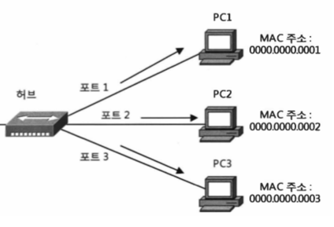
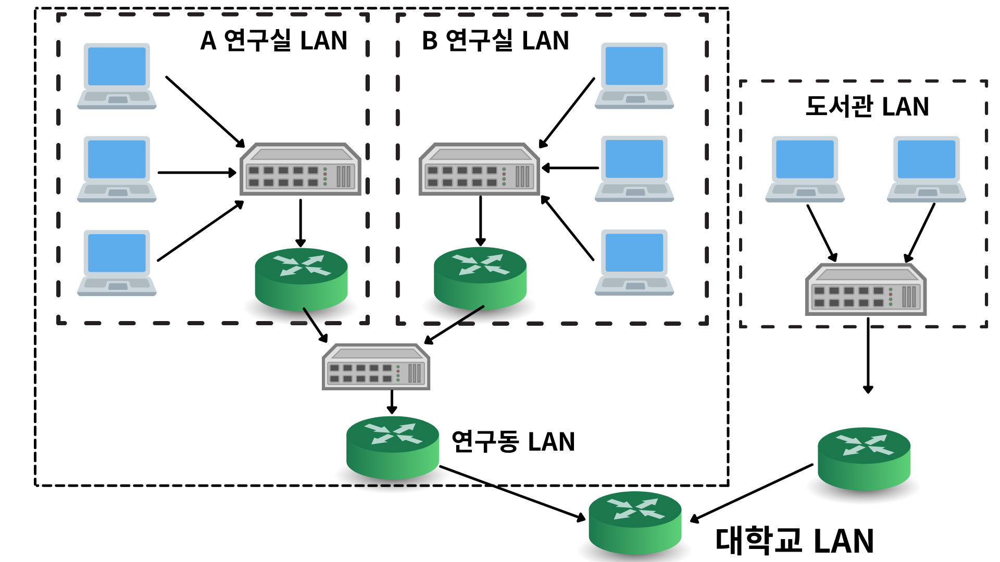
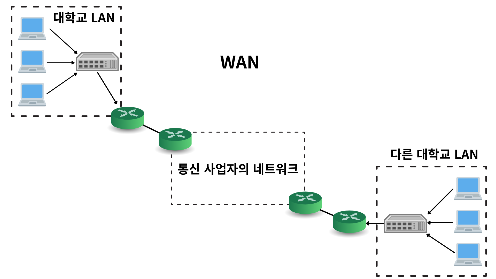

# 네트워크

## 네트워크란?
무언가와 무언가가 그물망처럼 무언가에 의해 **연결되어 있는 상태** + 연결된 상태를 이용해서 **무언가를 주고 받는 것**   
ex. 물류망, 신경망, 전화망, 철도망, 컴퓨터 네트워크 등등..   
ex. 물류망은 물건들을 주고 받음, 전화망은 전화를 주고 받음 ...   
점(노드)과 점이 선(링크)으로 연결되어 있는 상태에서 무언가를 주고 받는것

## 컴퓨터 네트워크란?

컴퓨터와 컴퓨터가 그물망처럼 통신매체로 연결되어서 데이터를 주고 받는 것

데이터 통신으로 컴퓨터가 가진 리소스를 서로 주고받음으로써 공유하는 것

## 네트워크를 사용하는 이유
* 자신의 컴퓨터가 아닌 다른 컴퓨터와 리소스를 주고 받기 위해 사용
> 리소스란?
> 컴퓨터나 사용자가 가진 물리적, 논리적을 따지지 않는 자원
> 프린터, 파일에 쓰여진 정보 등등
* 리소스를 공유함으로써 한 대의 컴퓨터로는 할 수 없었던 일이 가능해짐
  * 하나의 프린터를 여러대의 컴퓨터에서 사용가능
  * 정보를 홈페이지에 공유하여 여러사람이 볼 수 있게함
* 멀리 떨어진 사람에게 정보를 전달하거나 정보를 받는것이 가능

## 데이터 통신
리소스를 공유하기 위해서 컴퓨터가 가진 리소스를 주고받아야함. -> **데이터 통신이 필요**   
> 데이터란? 무언가에 대한 정보를 컴퓨터상에서 표현한 것

컴퓨터상에서의 리소스를 공유하기 위한 데이터는 **비트(Bit)**로 구성됨   
-> 0 또는 1로 표현

### 프로토콜 (Protocol)
데이터를 주고받기 위한 규칙

데이터 통신에서 0과 1로 주고받을 때 예를들어 000001은 무엇을 표현하는지 규칙을 정해야합니다.
통신측과 수신측은 같은 규칙을 사용함으로써 데이터의 주고받기가 가능해집니다.

## 패킷 교환 방식
컴퓨터 네트워크는 패킷 교환방식을 사용
송신할 데이터를 한번에 보내지않고 여럿으로 분할해서 송신하는 것
여럿으로 작게 분할했기 떄문에 회선을 점유하는 시간이 짧다   
-> 한번에 하나의 데이터 통신만 이뤄지는게 아니라 여러개의 데이터 통신 패킷을 섞어서 보내므로 다수의 컴퓨터가 회선을 공유할 수 있다.

* 주의할 점
  * 패킷이 순서대로 오지 않을 수 있음
  * TCP는 패킷을 재조립하고 재전송을 요청하는 등 흐름을 관리

## 네트워크의 구조

네트워크 통신을 위해 필요한 것
* 데이터를 송신할 컴퓨터와 수신할 컴퓨터
* 통신매체와 인터페이스
* 라우터

### 세그먼트
케이블 분배기로 연결되는 범위 == 세그먼트 (라우터 X)

세그먼트 범위 내의 컴퓨터 끼리는 라우터가 없어도 데이터 송수신이 가능합니다.

* 허브
  * 케이블을 T자 분배기로 만드는 것은 번거로움
  * 허브에 언제든 연결만 하면 되므로 편안함
  * 허브를 사용한 네트워크에서는 컴퓨터 한 대가 세그먼트 내의 어떤 컴퓨터에도 자유롭게 데이터를 송수신할 수 있음
    * 이런 네트워크 구조를 멀티 액세스 네트워크 라고함

### 네트워크 구조면에서의 분류
* 멀티 액세스 네트워크 : 복수의 컴퓨터에 의한 데이터 송수신이 가능한 방식
* 포인트 투 포인트 네트워크 : 컴퓨터 한 대가 다른 단 대의 컴퓨터에만 데이터를 보내는 방식
  * 전용선 : 공정된 컴퓨터에만 데이터를 보낼 수 있는 회선
멀티 액세스 네트워크, 포인트 투 포인트 네트워크 두 가지를 조합해서 패킷 교환 네트워크가 만들어짐

컴퓨터 -> 라우터 : 멀티 액세스 네트워크
라우터 -> 라우터 : 포인트 투 포인트 네트워크

### 네트워크의 범위나 규모 분류
* LAN(Local Area Network)
  * 구내에 설치된 네트워크
    * 구내란? 가정, 사무실 빌딩 같은 지역적으로 좁은 범위
  * 지역적으로 좁은 범위에서 본인이 책임지고 구축하는 네트워크
    * 케이블 설치, 라우터 배치 등을 직접 해서 네트워크를 만듬

* WAN(Wide Area Network)
  * 떨어져 있는 지역의 LAN끼리 통신사업자의 통신 케이블을 빌려서 연결한 네트워크
    * KT, LG, SKT등이 통신사업자라고 한다.
    * 즉 위 회사들의 케이블을 빌려서 사용하는 것
  * 세계적 규모의 WAN은 The Internet 또는 The Net이라고 부름

### LAN과 WAN의 차이
* LAN
  * 범위가 좁다
  * 케이블 설치는 자신이 직접한다.
  * 사용 요금은 무료
  * 통신속도는 WAN에 비해 고속
  * 통신 에러 발생률이 낮다
* WAN
  * 범위가 넓다
  * 케이블 설치는 통신사업자가 한다.
  * 사용 요금은 유료다.
  * 통신 속도가 LAN에 비해 느리다
  * 통신 에러 발생률이 높다.

## OSI 참조 모델 (Open Systems Interconnection Reference Model)
* ISO(International Organization for Standardization, 국제 표준화 기구)에서 프로토콜 규격의 통일을 표준화하려고 선언한 것이 OSI 참조 모델   
* OSI 참조 모델은 **데이터 통신의 단계 구성도**이다.
* 데이터 통신 전체를 표준화하기 위해서 먼저 데이터 통신 전체의 설계도를 만들려고 한 것
* 데이터 **통신을 단계로 나누어 각 단계의 순서를 명확히하고**, **이 모델에 따라 프로토콜을 정의하여 데이터 통신을 구축**하려고 한 것
* 표준화에는 실패했지만 현재에도 데이터 통신을 설명하는데 OSI 참조 모델을 사용해서 설명하는 경우가 많다.
* 중요한건 통신을 단계로 나눈다는 발상이 필요하다는 것

OSI 참조 모델은 데이터 통신을 7개의 단계로 나눈다. 이 단계를 계층(Layer)이라고 부른다.

* OSI 참조 모델의 계층
  * 각 계층마다 각각의 역할과 규칙이 있다 
    * 제 7계층(응용 계층): 사용자에게 네트워크 서비스를 제공
    * 제 6계층(표현 계층): 데이터의 형식을 결정
    * 제 5계층(세션 계층): 데이터 송수신의 순서 등을 관리
    * 제 4계층(전송 계층): 신뢰성이 높은(에러가 적은)전송을 시행
    * 제 3계층(네트워크 계층): 전송 규칙과 수신처를 결정
    * 제 2계층(데이터링크 계층): 인접기기 사이의 데이터 전송을 제어
    * 제 1계층(물리 계층): 전기, 기계적인 부분의 전송을 시행
  * 각 계층은 독립적
    * 예를들어 표현 계층은 데이터의 형식만을 생각하면 됨
    * 즉, 어떤 계층의 프로토콜 변경은 다른 계층에 영향을 끼치지 않는다.
    * 하위 계층은 상위 계층을 위해서 일하고 상위 계층은 하위 계층에 관여하지 않는다.
  * 데이터를 운반하기 위해서는 데이터 이외에 다른 것도 필요
    * 데이터 말고도 주소 같은 것들을 데이터와 함께 보내야함
    * 데이터랑 데이터를 보내기 위해 필요한 것들이 통합된 상태 -> 프로토콜 데이터 유닛(Protocol Data Unit:PDU)
  * 캡슐화
    * 계층이라는 단계를 실시할 때마다 거기에서 필요한 정보를 추가할 수 있다.
    * 즉, 운반하고 싶은 데이터에 **헤더를 추가해서 '캡슐'을 만들어 간다.**
    * 캡슐화에서 추가되는 제어 데이터가 데이터의 앞에 붙이면 '헤더' 뒤에 붙이면 '꼬리부(Tailer)'라고 부른다.

### 프로토콜군 (Protocol Suite)
* 데이터 통신에 필요한 프로토콜은 한개가 아니라 여러개의 프로토콜로 이루어 졌다.
* 각 계층은 독립적이어야 하지만 너무 독립적이어서 상하계층과 완전히 연결이 안되면 곤란하므로 상하 프로토콜은 인터페이스를 결정해 둠 그것이 프로토콜 그룹 즉, 프로토콜 군 이다.
* 데이터 통신은 같은 프로토콜 군을 사용하는 컴퓨터나 기기끼리만 가능

## 프로토콜이 결정하는 것
* 어떤 헤더를 붙일지를 결정
  * 프로토콜이 있는 계층의 역할에 따른 기능이 있고 그것을 실현하기 위한 정보로서 헤더를 붙임
    * 이 헤더의 내용은 프로토콜로 정해져있다.
  * 데이터를 주고받는 순서와 데이터의 내용을 결정

## TCP/IP 모델
* 인터넷에서 사용되는 프로토콜군
* 현재 데이터 통신의 표준 프로토콜. 정확히는 사실 표준 프로토콜이다.
  * 사실 표준이란? 표준은 아니지만 사용되는 곳이 압도적으로 많아서 표준으로 취급되는 것 
* IETF(The Internet Engineering Task Force, 국제인터넷표준화기구)에서 제정한 프로토콜
  * 국제인터넷표준화기구에서 제정하는 문서인 RFC(Request For Comments)가 있는데 이것이 TCP/IP의 규격
* TCP/IP의 계층구조는 4계층으로 이뤄짐
  * 4계층 (애플리케이션 계층) == OSI 참조모델의 7,6,5계층(응용, 표현, 세션계층)에 해당
  * 3계층 (트랜스포트 계층) == OSI 참조모델의 4계층(전송 계층)에 해당
  * 2계층 (인터넷 계층) == OSI 참조모델의 3계층(네트워크 계층)에 해당
  * 1계층 (인터페이스 계층) == OSI 참조모델의 2,1계층(데이터링크 계층, 물리 계층)에 해당

