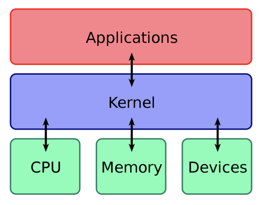

# OS (Operating System)
* [Kernel](#Kernel)
* [Process VS Thread](#Process VS Thread (프로세스와 쓰레드의 차이))
* [멀티 프로세스 대신 멀티 스레드를 사용하는 이유](#멀티프로세스대신멀티스레드를사용하는이유)
* [사용자 프로그램은 어떻게 입출력을 하는가?](#사용자프로그램은어떻게입출력을하는가?)

## Kernel
운영체제도 하나의 소프트웨어로서 전원이 켜짐과 동시에 메모리에 올라갑니다. 하지만 운영체제처럼 규모가 큰 프로그램이 전부 메모리에 올라가면 한정된 메모리의 공간의 낭비가 심할 것입니다.
따라서 운영체제 중 **항상 필요한 부분만을** 전원이 켜짐과 동시에 메모리에 올려놓고 그렇지 않은 부분은 필요할 때 메모리로 올려서 사용하게 됩니다.
이때 메모리에 상주하는 부분을 커널이라고 부르며 좁은 의미의 운영체제라고 부릅니다.

즉 커널은 운영체제 중에서도 핵심적인 부분을 뜻합니다. 넓은 의미의 운영체제는 커널뿐 아니라 시스템을 위한 유틸리티들을 광범위하게 포함하는 개념입니다.

커널은 결국 컴퓨터 자원을 사용할 수 있게 이어주는 중간 다리 역할을 합니다.
애플리케이션이 SCI(시스템 호출 인터페이스)를 호출해서 커널을 통신하여 컴퓨터 자원을 사용합니다.

### 커널의 기능 4가지 (리눅스)

* 메모리 관리: 메모리가 어디에서 무엇을 저장하는데 얼마나 사용되는지를 추적
* 프로세스 관리: 어느 프로세스가 CPU를 얼마나 오랫동안 사용할 지를 결정합니다.
* 장치 드라이버: 하드웨어와 프로세스 사이의 중재자/인터프리터 역할을 합니다.
* 시스템 호출 및 보안: 프로세스의 서비스 요청을 수신합니다.
 
올바르게 구현된 커널은 사용자가 볼 수 없습니다. 커널 공간이라는 자신만의 공간에서 메모리를 할당하고 저장되는 모든 항목을 추적합니다.   
웹 브라우저 및 파일과 같이 사용자가 볼 수 있는 것을 사용자 공간이라고 합니다. 이러한 애플리케이션은 SCI(System Call Interface, 시스템 호출 인터페이스)를 통해 커널과 통신합니다.

커널은 강력한 경영진(하드웨어)를 위해 바쁘게 일하는 비서입니다.   
비서의 할 일은 다음과 같습니다.
* 직원및 손님(사용자)로 부터 수신되는 메세지 및 요청(프로세스)를 경영진에게 전달 
* 어디에 무엇이 저장되어 있는지 기억(메모리)하고
* 특정한 시간에 누가 경영진을 얼마 동안 만날 수 있을지 결정합니다.(CPU 사용시간을 결정)

## Process VS Thread (프로세스와 쓰레드의 차이)

* 프로그램이란?
  + 어떤 작업을 실행할 수 있는 파일. 저장장치에 저장되어 있는 정적인 상태

* 프로세스란?
  + 컴퓨터에서 연속적으로 실행되고 있는 컴퓨터 프로그램. 실행을 위해 메모리에 올라온 동적인 상태
    - 메모리에 올라와 실행되고 있는 프로그램의 인스턴스 (독립적인 개체)
    - 운영체제로부터 시스템 자원을 할당받는 작업의 단위
    - 즉, 동적인 개념으로는 실행된 프로그램을 의미
  + 할당받는 시스템 자원의 예
    - CPU 시간
    - 운영되기 위해 필요한 주소 공간
    - Code, Data, Stack, Heap의 구조로 되어 있는 독립된 메모리 영역
  + 특징
    - 프로세스는 각각 독립된 메모리 영역(Code, Data, Stack, Heap의 구조)을 할당받습니다.
    - 기본적으로 프로세스당 최소 1개의 스레드(메인 스레드)를 가지고 있습니다.
    - 각 프로세스는 별도의 주소 공간에서 실행되며, 한 프로세스의 변수나 자료구조에 접근할 수 없습니다.
    - 한 프로세스가 다른 프로세스의 자원에 접근하려면 프로세스 간의 통신(IPC, inter-process communication)을 사용해야 합니다.(ex. 파이프, 파일, 소켓 등을 이용한 통신 방법 이용)
  + 프로세스의 상태
    - 생성 상태 : 프로그램을 메모리에 가져와 실행 준비가 완료된 상태
    - 준비 상태 : 실행을 기다리는 모든 프로세스가 자기 차례를 기다리는 상태(CPU 스케줄러가 실행될 프로세서를 선택합니다)
    - 실행 상태 : 선택된 프로세스가 타임 슬라이스를 얻어서 CPU를 사용하는 상태입니다. (프로세스 사이에 문맥 교환이 일어납니다)
    - 대기 상태 : 실행 상태에 있는 프로세스가 입출력을 요청하면 입출력이 완료될 때까지 기다리는 상태입니다.(입출력이 완료되면 준비 상태로 갑니다)
    - 완료 상태 : 프로세스가 종료된 상태입니다. 사용하던 모든 데이터가 정리됩니다. 정상 종료인 exit와 비정상 종료인 abort를 포함합니다.

* 스레드(Thread)란?
  + 프로세스 내에서 실행되는 여러 흐름의 단위
    - 프로세스의 특정한 수행 경로
    - 프로세스가 할당받은 자원을 이용하는 실행의 단위
  + 특징
    - 스레드는 프로세스 내에서 각각 **Stack만 따로 할당받고 Code, Data, Heap 영역은 공유합니다.**
    - 스레드는 한 프로세스 내에서 동작되는 여러 실행의 흐름으로, 프로세스 내의 주소 공간이나 자원들(힙 공간 등)을 
    같은 프로세스 내에 스레드끼리 공유하면서 실행됩니다.
    - 같은 프로세스 안에 있는 여러 스레드들은 같은 힙 공간을 공유합니다. 반면에 프로세스는 다른 프로세스의 메모리에 직접 접근할 수 없습니다.
    - 각각의 스레드는 별도의 레지스터와 스택을 갖고 있지만, 힙 메모리는 서로 읽고 쓸 수 있습니다.
    - 한 스레드가 프로세스 자원을 변경하면, 다른 이웃 스레드(sibling thread)도 그 변경 결과를 즉시 볼 수 있습니다.

> 프로세스와 스레드 간의 관계
> 스레드는 Stack만 할당받고 Code, Data, Heap영역은 프로세스 내부의 것을 공유합니다.

## 자바 스레드(Java Thread)란?
  + 일반 스레드와 거의 차이가 없음며, JVM이 운영체제의 역할을 합니다.
  + **자바에는 프로세스가 존재하지 않고 스레드만 존재하며**, 자바 스레드는 JVM에 의해 스케줄되는 실행 단위 코드 블록입니다.
  + 자바에서 스레드 스케줄링은 전적으로 JVM에 의해 이루어집니다.
  + 아래와 같은 스레드와 관련된 많은 정보들도 JVM이 관리합니다.
    - 스레드가 몇 개 존재하는지
    - 스레드로 실행되는 프로그램 코드의 메모리 위치는 어디인지
    - 스레드의 상태는 무엇인지
    - 스레드 우선순위는 얼마인지
  + 즉, 개발자는 자바 스레드로 작동할 스레드 코드를 작성하고, 스레드 코드가 생명을 가지고 실행을 시작하도록 JVM에 요청하는 일 뿐입니다.
  
## 멀티 프로세스 대신 멀티 스레드를 사용하는 이유

프로그램을 여러개 키는 것보다 하나의 프로그램 안에서 여러 작업을 해결하는 것

1. 자원의 효율성 증대
  - 멀티 프로세스로 실행되는 작업을 멀티 스레드로 실행할 경우, 프로세스를 생성하여 자원을 할당하는 시스템 콜이 줄어들어 자원을 효율적으로 관리할 수 있습니다.
    + 프로세스간의 Context Switching시 단순히 CPU 레지스터 교체 뿐만 아니라 RAM과 CPU사이의 캐시 메모리에 대한 데이터까지 초기화되므로 오버헤드가 크기 때문
  - 스레드는 프로세스 내의 메모리를 공유하기 때문에 독립적인 프로세스와 달리 스레드간 데이터를 주고 받는 것이 간단해지고 시스템 자원 소모가 줄어들게 됩니다.
2. 처리 비용 감소 및 응답 시간 단축
  - 프로세스 간의 통신(IPC)보다 스레드 간의 비용이 적으므로 작업들 간의 통신의 부담이 줄어듭니다.
    + 스레드는 Stack 영역을 제외한 모든 메모리를 공유하기 때문
  - 프로세스 간의 전환 속도보다 스레드간의 전환 속도가 빠릅니다.
    + Context Switching시 스레드는 Stack 영역만 처리하기 때문

> 스레드간의 자원을 공유할 때는 동기화 문제에 주의해야합니다.   
> 스레드 간의 자원 공유는 전역 변수(데이터 세그먼트)를 이용하므로 함께 사용할 때 충돌이 발생할 수 있습니다.

## Thread-safe

* Thread-safe란?
  + 멀티스레드 환경에서 여러 스레드가 동시에 하나의 객체 및 변수(공유 자원)에 접근할 떄, 의도한 대로 동작하는것
* Thread-safe하게 구현하기
  + Thread-safe하기 위해서는 공유 자원에 접근하는 임계영역(critical section)을 동기화 기법으로 제어해줘야 합니다.
    - 이를 '상호 배제' 라고 합니다.
  + 동기화 기법으로는 Mutex나 Semaphore 등이 있습니다.
* Reentrant
  + Reetrant는 재진입성 이라는 의미로, 어떤 함수가 Reetrant하다는 것은 여러 스레드가 동시에 접근해도 언제나 같은 실행 결과를 보장한다는 의미입니다.
  + 재진입성을 만족하기 위해서는 해당 서브루틴에서 공유자원을 사용하지 않으면 됩니다.
    - 예를들어 정적(전역) 변수를 사용하거나 반환하면 안되고 호출 시 제공된 매개변수만으로 동작해야 합니다.
  + 따라서, Reentrant 하다면 Thread-safe하지만 그 역은 성립하지 않습니다.
  
## 동기화 객체의 종류

* 스레드 동기화 방법
  + 실행 순서의 동기화
    - 스레드의 실행순서를 정의하고, 이 순서에 반드시 따르도록 하는 것
  + 메모리 접근에 대한 동기화 
    - 메모리 접근에 있어서 동시 접근을 막는 것
    - 실행의 순서가 중요한 상황이 아니고, 한 순에 하나의 스레드만 접근하면 되는 상황을 의미
* 동기화 기법의 종류
  + 유저 모드 동기화
    - 커널의 힘을 빌리지 않는(커널 코드가 실행되지 않는) 동기화 기법
    - 성능상 이점, 기능상의 제한
    - ex. 임계 구간기반의 동기화, 인터락 함수 기반의 동기화
  + 커널 모드 동기화
    - 커널에서 제공하는 동기화 기능을 활용하는 방법
    - 커널 모드로의 변경이 필요하고 이는 성능 저하로 이어짐, 다양한 기능 활용 가능
    - ex. 뮤텍스 기반의 동기화, 세마포어 기반의 동기화, 이름있는 뮤텍스 기반의 프로세스 동기화, 이벤트 기반의 동기화

### 뮤텍스 (Mutex)
  + 공유된 자원의 데이터에 여러 스레드가 접근하는 것을 막는 것
  + 상호배제 라고도 하며, Critical Section을 가진 스레드의 Running time이 서로 겹치지 않도록 각각 단독으로 실행하게 하는 기술
  + 다중 프로세스들의 공유 리소스에 대한 접근을 조율하기 위해 synchronized 또는 lock을 사용합니다.
    - 즉, 뮤텍스 객체를 두 스레드가 동시에 사용할 수 없습니다.
    - 뮤텍스 객체는 어딘가에 출입하기 위한 key에 비유할 수 있습니다.

### 세마포어(Semaphore)
  + 공유된 자원의 데이터에 여러 프로세스가 접근하는 것을 막는 것
  + 리소스 상태를 나타내는 간단한 카운터라고 볼 수 있습니다.
    - 프로세스가 리소스에 접근할 때 카운터는 -1 하고 사용이 끝나면 +1 시킵니다.
    - 카운터가 0이라면 더이상 프로세스가 리소스에 접근할 수 없고 대기해야합니다.
    - 운영체제 또는 커널의 지정된 저장장치 내의 값입니다.
    - 일반적으로 비교적 긴 시간을 확보하는 리소스에 대해 사용합니다.
    - 유닉스 시스템 프로그래밍에서 세마포어는 운영체제의 리소스를 경쟁적으로 사용하는 다중 프로세스에서 행동을 조정하거나 또는 동기화 시키는 기술입니다.
  + 공유 리소스에 접근할 수 있는 프로세스의 최대 허용치만큼 동시에 사용자가 접근하여 사용할 수 있습니다.
  + 각각의 프로세스는 세마포어 값을 확인하고 변경할 수 있습니다.
    - 최대 사용량만큼 사용중이 아니라면 즉시 사용할 수 있습니다.
    - 해당 리소스가 이미 최대 허용치만큼 사용 중이라면 재시도 하기전에 일정 시간을 대기해야합니다.
    - 세마포어를 사용하는 프로세스는 그 값을 확인하고 사용할 때는 값을 변경하여 다른 프로세스가 세마포어의 최신 상태를 알 수 있도록 해야합니다.
* 뮤텍스와 세마포어의 차이
  + 뮤텍스는 동기화 대상이 하나뿐일때, 세마포어는 하나 이상일 때 사용합니다.
  + 세마포어는 뮤텍스가 될 수 있지만, 뮤텍스는 세마포어가 될 수 없습니다.
  + 세마포어는 소유할 수 없지만, 뮤텍스는 사용자가 소유하고 이에 대한 책임을 가집니다.
  + 뮤텍스는 뮤텍스를 소유하고 있는 사용자가 뮤텍스를 해제할 수 있습니다. 세마포어는 소유하고 있지 않더라도 해제할 수 있습니다.
  + 세마포어는 시스템 범위에 걸쳐있고 파일 시스템상의 파일로 존재하지만, 뮤텍스는 프로세스상에 존재하며 프로세스가 종료될 때 CleanUp됩니다.
  
## 사용자 프로그램은 어떻게 입출력을 하는가?
1. System Call: 사용자 프로그램이 운영체제에게 IO 요청을 하는것
2. Trap(Software Interrupt)를 사용하여 인터럽트 벡터의 특정 위치로 이동
3. 제어권이 인터럽트 벡터가 가리키는 인터럽트 서비스 루틴으로 이동
   * 해당 인터럽트의 처리 루틴(I/O명령 수행하는 method) 주소를 가지고 있음
4. 올바른 I/O 요청인지 확인 후 I/O 수행
5. I/O 완료시 제어권을 다시 시스템콜 다음 명령으로 옮김

> 인터럽트(interrupt) : 하드웨어의 인터럽트(interrupt)   
> * 인터럽트 당한 시점의 레지스터와 pc를 save한 후 cpu의 제어를 인터럽트 처리 루틴에 남긴다.   
> 
> Trap: 소프트웨어 interrupt   
> * Exception : 오류를 범한 경우   
> * SystemCall : 사용자 프로그램이 운영체제에게 IO 요청